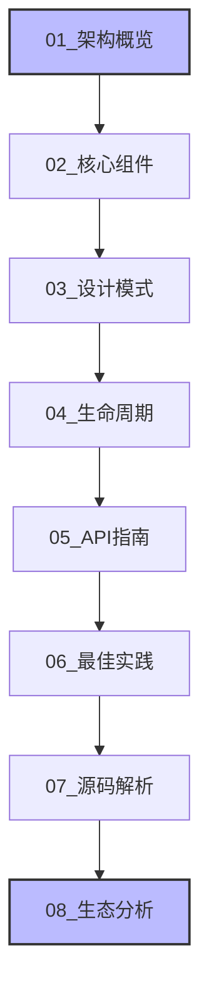

# 📚 Masonry 深度学习文档

> 一份全面深入的 **Masonry** 源码分析与使用指南
>
> **版本**: v1.0
> **最后更新**: 2024-12-23
> **适用对象**: iOS/macOS 开发者

---

## 🎯 项目概述

Masonry 是一个轻量级的 Objective-C Auto Layout 框架，提供了链式 DSL 语法来简化 iOS/macOS 的约束布局。本项目包含 **8个详细文档**，从架构设计到源码实现，全方位深度解析 Masonry。

### 📊 文档统计
- 📄 **8个章节**，覆盖所有核心内容
- 🎨 **20+个 Mermaid 图表**，可视化复杂概念
- 💻 **100+个代码示例**，理论结合实践
- ⏱️ **预计阅读时间**: 4-6小时

---

## 📖 阅读指南

### 🎯 推荐阅读顺序



**分阶段学习**：

#### 🏗️ **架构篇** (1-2小时)
1. **[01_架构概览](markdown/01_架构概览.md)** - 建立整体认知
2. **[02_核心组件](markdown/02_核心组件详解.md)** - 理解核心类

#### 🎨 **设计篇** (1小时)
3. **[03_设计模式](markdown/03_设计模式分析.md)** - 学习设计思想

#### ⚙️ **实现篇** (1-2小时)
4. **[04_生命周期](markdown/04_生命周期流程.md)** - 掌握完整流程
5. **[07_源码解析](markdown/07_源码深度解析.md)** - 深入源码

#### 🛠️ **实践篇** (1小时)
6. **[05_API指南](markdown/05_API使用指南.md)** - 实际应用
7. **[06_最佳实践](markdown/06_最佳实践.md)** - 优化技巧

#### 🌍 **扩展篇** (30分钟)
8. **[08_生态分析](markdown/08_生态分析.md)** - 了解全局

---

## 📑 文档详情

### 1️⃣ **[架构概览](markdown/01_架构概览.md)**
```
🎯 目标: 理解整体架构和设计思想
⏱️ 时长: 30分钟
📊 图表: 5个
```

**内容要点**：
- ✅ 核心组件关系图
- ✅ 数据流向分析
- ✅ 跨平台适配策略
- ✅ 设计决策解析

**学习收获**：
```
建立 Masonry 的整体认知框架
理解为什么这样设计
```

---

### 2️⃣ **[核心组件详解](markdown/02_核心组件详解.md)**
```
🎯 目标: 深入每个核心类的实现
⏱️ 时长: 60分钟
📊 图表: 4个
```

**内容要点**：
- ✅ MASConstraintMaker 完整解析
- ✅ MASConstraint 抽象基类
- ✅ MASViewConstraint 单约束
- ✅ MASCompositeConstraint 复合约束
- ✅ MASViewAttribute 基础单元

**代码深度**：
```objective-c
// 每个方法都有详细解析
- (NSArray *)install;
- (MASConstraint * (^)(id))equalTo;
- (void)constraint:(MASConstraint *)constraint shouldBeReplacedWithConstraint:(MASConstraint *)replacementConstraint;
```

---

### 3️⃣ **[设计模式分析](markdown/03_设计模式分析.md)**
```
🎯 目标: 识别并理解设计模式
⏱️ 时长: 40分钟
📊 图表: 3个
```

**模式覆盖**：
- 🏭 **工厂方法**: MASConstraintMaker
- 🏗️ **建造者模式**: 链式API
- 🌳 **组合模式**: MASCompositeConstraint
- 📡 **代理模式**: MASConstraintDelegate
- 🎯 **策略模式**: 三种创建方法
- 🔧 **适配器模式**: MASViewAttribute

**学习价值**：
```
掌握设计模式的实际应用
学习如何设计流畅的API
```

---

### 4️⃣ **[生命周期流程](markdown/04_生命周期流程.md)**
```
🎯 目标: 掌握约束完整生命周期
⏱️ 时长: 45分钟
📊 图表: 4个
```

**流程解析**：
```
用户调用API → 创建工厂 → 配置约束 → 安装约束 → 生成原生约束
```

**三种方法对比**：
| 方法 | 流程 | 适用场景 |
|------|------|----------|
| makeConstraints | 直接添加 | 首次创建 |
| updateConstraints | 查找并更新 | 动态调整 |
| remakeConstraints | 清理后添加 | 完全重置 |

---

### 5️⃣ **[API使用指南](markdown/05_API使用指南.md)**
```
🎯 目标: 掌握所有API和使用技巧
⏱️ 时长: 50分钟
```

**内容架构**：
```
基础属性 → 复合属性 → 高级属性 → 链式配置 → 批量操作 → 常见场景
```

**场景覆盖**：
- ✅ 基础布局（填充、居中）
- ✅ 复杂排列（水平、垂直）
- ✅ 动态布局（键盘、动画）
- ✅ 条件布局（状态切换）

---

### 6️⃣ **[最佳实践](markdown/06_最佳实践.md)**
```
🎯 目标: 性能优化和安全实践
⏱️ 时长: 45分钟
```

**核心内容**：
```
性能优化     → 创建性能、内存管理
调试技巧     → 监控、错误处理
安全实践     → 循环引用、版本兼容
扩展开发     → 自定义API
```

**关键检查清单**：
```markdown
□ 使用updateConstraints代替makeConstraints
□ 弱引用防止循环泄漏
□ 添加key便于调试
□ 处理iOS版本差异
□ 避免在layoutSubviews中创建约束
```

---

### 7️⃣ **[源码深度解析](markdown/07_源码深度解析.md)**
```
🎯 目标: 逐行理解核心源码
⏱️ 时长: 60分钟
```

**深度剖析**：
- 🔍 **MASConstraintMaker**: 工厂 + 管理器
- 🔍 **MASConstraint**: 链式API的魔法
- 🔍 **MASViewConstraint**: NSLConstraint包装
- 🔍 **MASCompositeConstraint**: 组合管理
- 🔍 **View+MASAdditions**: Category入口

**代码行数解析**：
```
核心类约 500行代码
本章解析约 80% 关键逻辑
```

---

### 8️⃣ **[生态分析](markdown/08_生态分析.md)**
```
🎯 目标: 了解全局和未来趋势
⏱️ 时长: 30分钟
```

**分析维度**：
```
竞品对比    → PureLayout/SnapKit/Cartography
社区生态    → GitHub数据/学习资源
版本演进    → 历史路线/未来方向
选择建议    → 决策树/场景对照
```

---

## 🎓 学习路径与建议

### 🚀 快速入门 (1小时)
```
01_架构概览 → 05_API指南
目标: 能够使用Masonry开发
```

### 📚 系统学习 (3小时)
```
01_架构概览 → 02_核心组件 → 03_设计模式 → 05_API指南
目标: 理解原理并熟练运用
```

### 🔬 深度研究 (6小时)
```
全部8个章节，配合源码阅读
目标: 成为专家级别
```

### 💡 实践方法
1. **边读边练**：每个章节都有代码示例，动手运行
2. **对照源码**：打开Masonry源码，对照文档阅读
3. **画图理解**：自己画架构图和流程图
4. **总结笔记**：记录关键知识点和思考

---

## 🔍 图表索引

### 架构图
- [x] Mindmap - 整体架构 (01)
- [x] ClassDiagram - 核心类关系 (01, 02, 03)
- [x] ComponentDiagram - 组件依赖 (01, 08)

### 流程图
- [x] Flowchart - 数据流向 (01, 02, 04)
- [x] SequenceDiagram - 时序流程 (01, 04)
- [x] StateDiagram - 状态转换 (04)

### 其他图表
- [x] Timeline - 版本演进 (08)
- [x] PieChart - 社区数据 (08)
- [x] Gantt - 项目时间线 (08)

---

## 💻 代码示例统计

### 基础用法
```objective-c
// 1. 填充父视图
make.edges.equalTo(superview);

// 2. 居中
make.center.equalTo(superview);

// 3. 固定尺寸
make.width.mas_equalTo(100);
make.height.mas_equalTo(50);
```

### 高级用法
```objective-c
// 4. 比例关系
make.width.equalTo(superview).multipliedBy(0.5);

// 5. 优先级
make.left.equalTo(superview).priorityHigh();

// 6. 安全区域
make.top.equalTo(superview.mas_safeAreaLayoutGuideTop);
```

### 动态更新
```objective-c
// 7. 更新约束
[view mas_updateConstraints:^(MASConstraintMaker *make) {
    make.width.offset(newWidth);
}];

// 8. 重做约束
[view mas_remakeConstraints:^(MASConstraintMaker *make) {
    make.edges.equalTo(superview);
}];
```

---

## 🛠️ 工具与环境

### 阅读工具
- **推荐**: VS Code + Markdown预览
- **备选**: Typora / MacDown
- **移动端**: Obsidian

### 代码查看
- **Xcode**: 打开Masonry源码项目
- **GitHub**: 在线浏览
- **IDE**: 支持Objective-C的编辑器

### 图表渲染
- **Mermaid**: 大多数Markdown编辑器支持
- **在线**: mermaid.live
- **离线**: Mermaid CLI

---

## 📈 学习效果评估

### 基础掌握 ✅
- [ ] 理解整体架构
- [ ] 掌握基础API使用
- [ ] 能够处理常见场景

### 进阶提升 ⭐
- [ ] 理解设计模式
- [ ] 掌握生命周期
- [ ] 能够调试问题

### 专家水平 🏆
- [ ] 深入源码理解
- [ ] 性能优化实践
- [ ] 扩展框架功能

---

## 🤝 参与贡献

如果您发现文档中的错误或有改进建议，欢迎：

1. **提交Issue**: 指出具体问题
2. **PR改进**: 直接修改文档
3. **补充内容**: 分享使用心得

---

## 📝 学习笔记模板

```markdown
## 章节: [章节名称]

### 关键收获
-

### 疑问与思考
-

### 实践项目
-

### 代码片段
\`\`\`objective-c
// 你的代码
\`\`\`
```

---

## 🎯 学习目标达成

完成本系列文档学习后，你将能够：

### 🎯 **架构层面**
- ✅ 描述Masonry整体架构
- ✅ 解释核心组件职责
- ✅ 分析数据流向

### 🎯 **技术层面**
- ✅ 熟练使用所有API
- ✅ 处理复杂布局场景
- ✅ 优化布局性能

### 🎯 **设计层面**
- ✅ 识别应用的设计模式
- ✅ 设计流畅的API
- ✅ 编写高质量代码

### 🎯 **扩展层面**
- ✅ 调试布局问题
- ✅ 扩展框架功能
- ✅ 参与社区贡献

---

## 📚 附录

### 快速参考
- [API速查表](markdown/05_API使用指南.md#快速参考)
- [最佳实践清单](markdown/06_最佳实践.md#最佳实践清单)
- [竞品对比表](markdown/08_生态分析.md#详细对比表)

### 扩展阅读
- [Masonry GitHub](https://github.com/SnapKit/Masonry)
- [Apple Auto Layout文档](https://developer.apple.com/documentation/uikit/auto_layout)
- [SwiftUI官方文档](https://developer.apple.com/xcode/swiftui/)

---

## 🏆 总结

Masonry 不仅是一个优秀的开源库，更是 **Objective-C 开源项目**的典范。通过深度学习 Masonry，你不仅可以掌握 Auto Layout 的精髓，还能学到：

- 🎨 **API设计的艺术**
- 🏗️ **架构分层的思想**
- 🎯 **设计模式的实践**
- ⚡ **性能优化的技巧**
- 🔍 **源码阅读的方法**

**祝你学习愉快，收获满满！** 🚀

---

**文档版本**: v1.0
**更新日期**: 2024-12-23
**适用范围**: iOS/macOS 开发者
**阅读时长**: 4-6小时