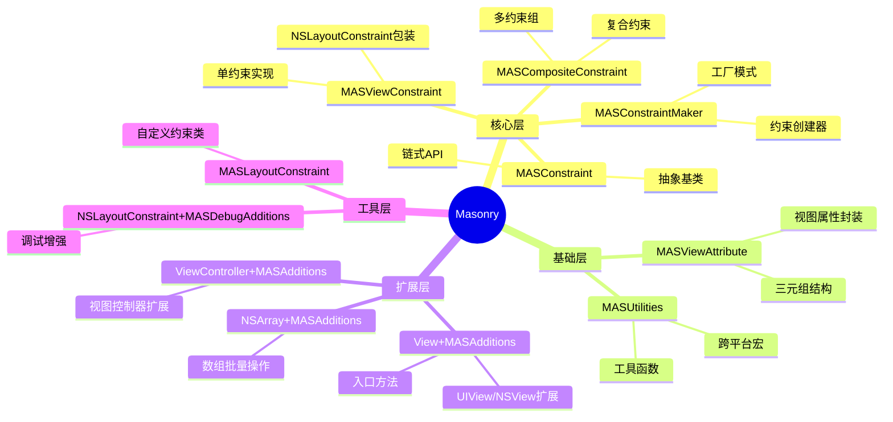
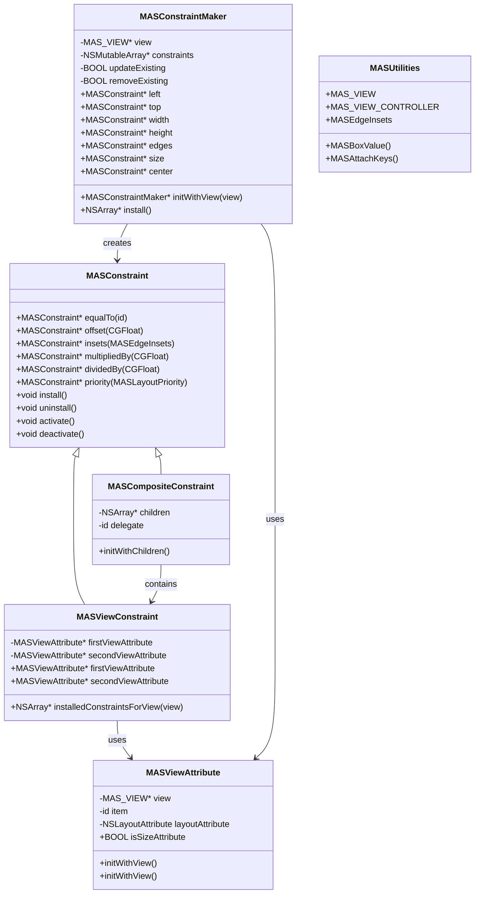
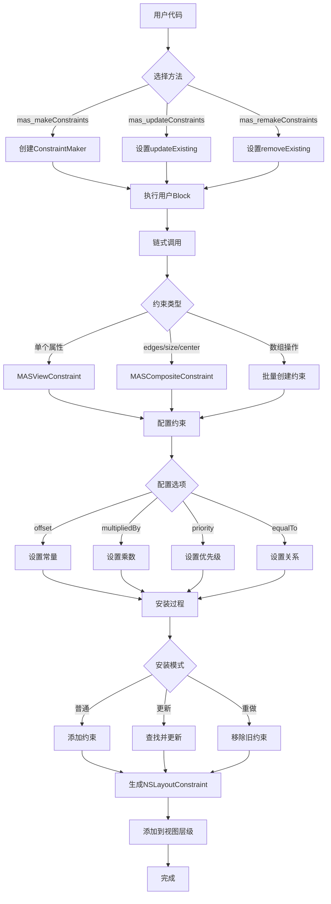
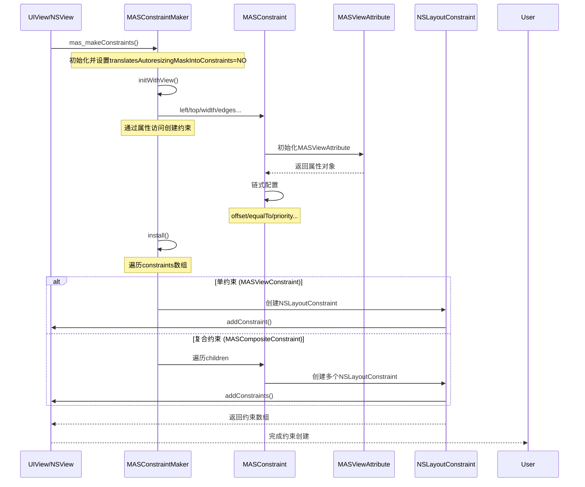
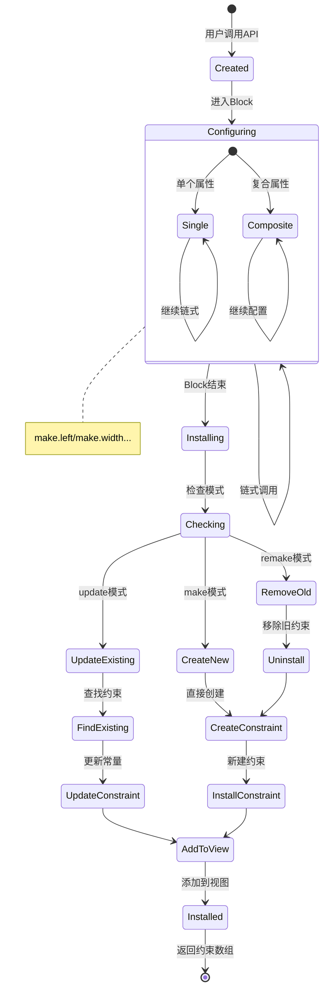
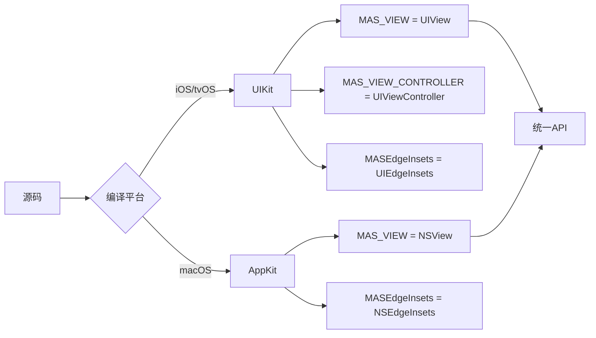
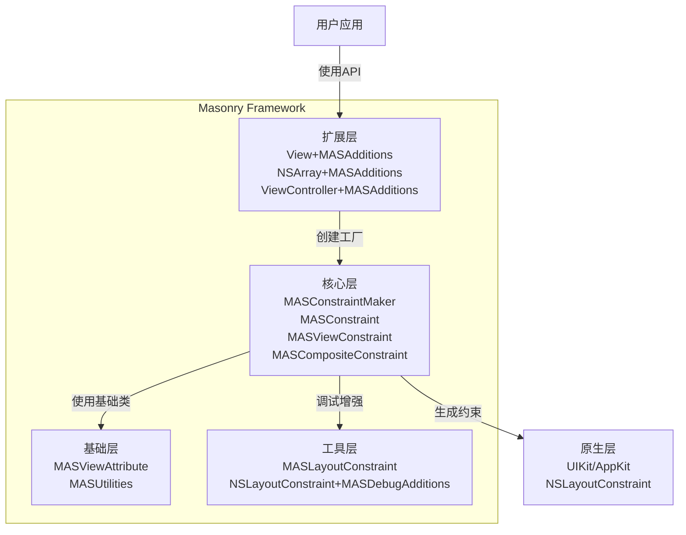
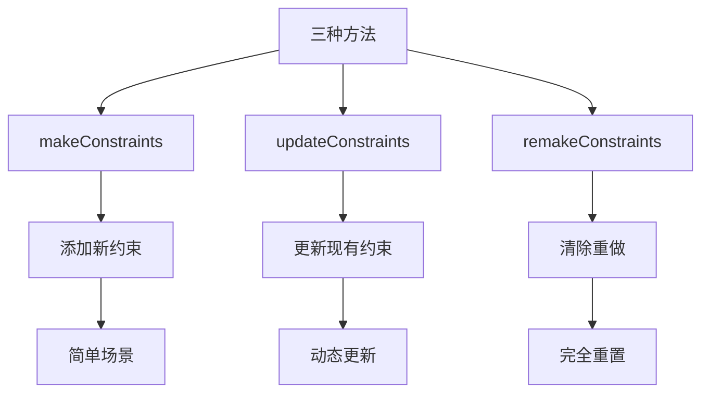

# 01_Masonry 架构概览

## 🎯 本章目标
- 理解 Masonry 的整体架构设计
- 掌握核心组件及其关系
- 了解数据流向和设计理念
- 建立完整的知识框架

---

## 📊 核心架构图





---

## 🔗 数据流向图



---

## ⏱️ 核心时序图



---

## 🔄 生命周期状态图



---

## 📈 技术栈分析

### 核心技术
| 技术类别 | 具体内容 | 作用 |
|---------|---------|------|
| **语言** | Objective-C | 跨平台基础 |
| **框架** | UIKit/AppKit | UI基础 |
| **特性** | Category | 扩展原生类 |
| **设计** | Block | 链式API |
| **运行时** | Runtime | 关联对象 |

### 跨平台适配


---

## 🎨 设计亮点

### 1. **工厂模式应用**
```objective-c
// MASConstraintMaker 作为工厂
MASConstraintMaker *maker = [[MASConstraintMaker alloc] initWithView:view];
MASConstraint *constraint = maker.left; // 创建具体约束
```

### 2. **组合模式处理复合约束**
```objective-c
// edges 返回 MASCompositeConstraint
make.edges.equalTo(superview);
// 内部包含 top, left, bottom, right 四个子约束
```

### 3. **代理模式管理约束替换**
```objective-c
// MASConstraintMaker 实现 MASConstraintDelegate
- (void)constraint:(MASConstraint *)constraint
shouldBeReplacedWithConstraint:(MASConstraint *)replacementConstraint
```

### 4. **Category 扩展原生类**
```objective-c
// 为 UIView/NSView 添加方法
- (NSArray *)mas_makeConstraints:(void(^)(MASConstraintMaker *))block;
```

---

## 📊 模块依赖关系



---

## 🔍 关键设计决策

### 1. **为什么使用 Category？**
- ✅ 无需继承，直接扩展原生类
- ✅ 保持 UIView/NSView 的使用习惯
- ✅ 避免侵入性修改

### 2. **为什么使用 Block？**
- ✅ 提供闭包环境，隔离约束配置
- ✅ 支持链式调用，代码更流畅
- ✅ 自动管理约束生命周期

### 3. **为什么区分三种创建方法？**


### 4. **为什么抽象 MASConstraint？**
- ✅ 统一接口：单约束和复合约束使用相同API
- ✅ 多态性：不同子类实现不同逻辑
- ✅ 扩展性：易于添加新约束类型

---

## 📦 核心数据结构

### MASViewAttribute
```objective-c
@interface MASViewAttribute : NSObject
@property (nonatomic, weak, readonly) MAS_VIEW *view;
@property (nonatomic, weak, readonly) id item;
@property (nonatomic, assign, readonly) NSLayoutAttribute layoutAttribute;
@end
```
**作用**：封装视图和属性的组合，作为约束方程的"变量"

### MASConstraintMaker
```objective-c
@interface MASConstraintMaker : NSObject
@property (nonatomic, weak) MAS_VIEW *view;
@property (nonatomic, strong) NSMutableArray *constraints;
@property (nonatomic, assign) BOOL updateExisting;
@property (nonatomic, assign) BOOL removeExisting;
@end
```
**作用**：约束工厂，管理约束的创建和安装

### MASConstraint
```objective-c
@interface MASConstraint : NSObject
// 链式方法
- (MASConstraint * (^)(id))equalTo;
- (MASConstraint * (^)(CGFloat))offset;
- (MASConstraint * (^)(MASLayoutPriority))priority;
// 安装方法
- (void)install;
- (void)uninstall;
@end
```
**作用**：约束抽象，提供统一的链式API

---

## 🎓 本章要点总结

### 架构特点
1. **分层清晰**：工具层 → 基础层 → 核心层 → 扩展层
2. **职责单一**：每个类都有明确的单一职责
3. **松耦合**：通过接口和代理实现模块解耦
4. **可扩展**：易于添加新的约束类型和功能

### 设计模式
- **工厂模式**：MASConstraintMaker 创建约束
- **组合模式**：MASCompositeConstraint 管理子约束
- **代理模式**：MASConstraintDelegate 处理约束替换
- **建造者模式**：链式API配置约束

### 核心流程
```
用户调用API → 创建工厂 → 配置约束 → 安装约束 → 生成原生约束
```

---

**下一章**：[02_核心组件详解](02_核心组件详解.md)

**返回目录**：[README](../README.md)