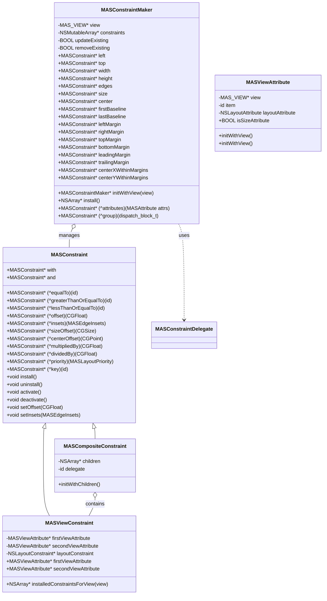
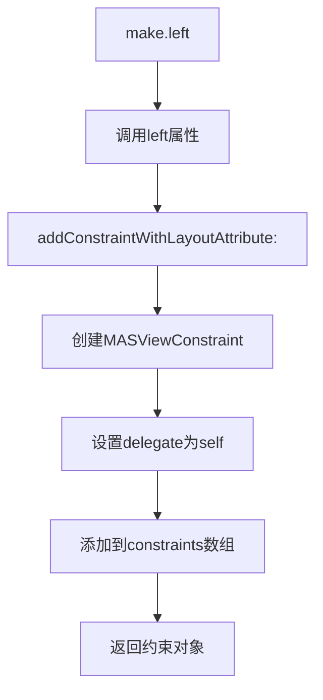
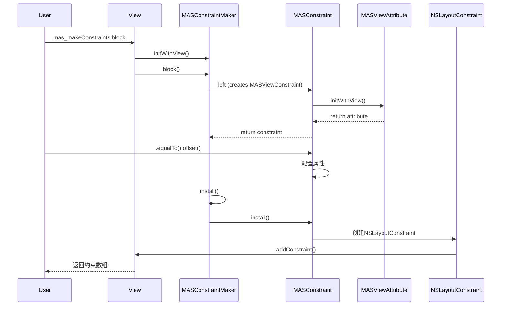

# 02_Masonry 核心组件详解

## 🎯 本章目标
- 深入理解每个核心类的内部实现
- 掌握关键方法的工作机制
- 了解组件间的协作方式
- 学习源码设计技巧

---

## 📊 核心组件关系图



---

## 🔍 MASConstraintMaker 深度解析

### 类定义与职责
```objective-c
@interface MASConstraintMaker () <MASConstraintDelegate>
@property (nonatomic, weak) MAS_VIEW *view;
@property (nonatomic, strong) NSMutableArray *constraints;
@end
```

**核心职责**：
1. **工厂角色**：根据属性返回对应的约束对象
2. **管理角色**：维护约束数组，控制安装流程
3. **委托角色**：处理约束替换和组合逻辑

### 初始化过程
```objective-c
- (id)initWithView:(MAS_VIEW *)view {
    self = [super init];
    if (!self) return nil;

    self.view = view;
    self.constraints = NSMutableArray.new;

    return self;
}
```

**关键点**：
- 使用 `weak` 引用视图，避免循环引用
- 初始化约束数组，准备收集约束
- 无强依赖，轻量级设计

### 属性访问机制
```objective-c
- (MASConstraint *)left {
    return [self addConstraintWithLayoutAttribute:NSLayoutAttributeLeft];
}

- (MASConstraint *)width {
    return [self addConstraintWithLayoutAttribute:NSLayoutAttributeWidth];
}
```

**工作流程**：


### 复合约束创建
```objective-c
- (MASConstraint *)edges {
    return [self addConstraintWithAttributes:MASAttributeTop | MASAttributeLeft |
                                              MASAttributeRight | MASAttributeBottom];
}

- (MASConstraint *)size {
    return [self addConstraintWithAttributes:MASAttributeWidth | MASAttributeHeight];
}

- (MASConstraint *)center {
    return [self addConstraintWithAttributes:MASAttributeCenterX | MASAttributeCenterY];
}
```

**内部实现**：
```objective-c
- (MASConstraint *)addConstraintWithAttributes:(MASAttribute)attrs {
    NSMutableArray *attributes = [NSMutableArray array];

    if (attrs & MASAttributeLeft) [attributes addObject:self.view.mas_left];
    if (attrs & MASAttributeRight) [attributes addObject:self.view.mas_right];
    // ... 其他属性

    NSMutableArray *children = [NSMutableArray array];
    for (MASViewAttribute *a in attributes) {
        [children addObject:[[MASViewConstraint alloc] initWithFirstViewAttribute:a]];
    }

    MASCompositeConstraint *constraint = [[MASCompositeConstraint alloc] initWithChildren:children];
    constraint.delegate = self;
    [self.constraints addObject:constraint];
    return constraint;
}
```

### 安装过程
```objective-c
- (NSArray *)install {
    // 1. 处理重做模式
    if (self.removeExisting) {
        NSArray *installedConstraints = [MASViewConstraint installedConstraintsForView:self.view];
        for (MASConstraint *constraint in installedConstraints) {
            [constraint uninstall];
        }
    }

    // 2. 复制约束数组（避免遍历时修改）
    NSArray *constraints = self.constraints.copy;

    // 3. 安装每个约束
    for (MASConstraint *constraint in constraints) {
        constraint.updateExisting = self.updateExisting;
        [constraint install];
    }

    // 4. 清空临时数组
    [self.constraints removeAllObjects];

    return constraints;
}
```

**关键设计**：
- **防御性复制**：使用 `copy` 避免遍历时修改
- **状态传递**：将 `updateExisting` 传递给子约束
- **清理现场**：安装后清空数组，避免内存泄漏

---

## 🔍 MASConstraint 抽象基类

### 核心API设计
```objective-c
// 链式配置方法
- (MASConstraint * (^)(id))equalTo;
- (MASConstraint * (^)(CGFloat))offset;
- (MASConstraint * (^)(MASLayoutPriority))priority;

// 语义化辅助属性
- (MASConstraint *)with;
- (MASConstraint *)and;

// 安装/卸载
- (void)install;
- (void)uninstall;
- (void)activate;
- (void)deactivate;

// 直接设置（用于更新）
- (void)setOffset:(CGFloat)offset;
- (void)setInsets:(MASEdgeInsets)insets;
```

### 链式调用实现原理
```objective-c
// MASConstraint.m
- (MASConstraint * (^)(id))equalTo {
    return ^id(id attribute) {
        // 子类实现具体逻辑
        return self;
    };
}
```

**使用示例**：
```objective-c
make.left.equalTo(superview).offset(10).priorityHigh();
```

**执行流程**：
```
1. make.left → 返回MASViewConstraint实例
2. .equalTo(superview) → 设置关系，返回self
3. .offset(10) → 设置偏移，返回self
4. .priorityHigh() → 设置优先级，返回self
```

### 语义化辅助属性
```objective-c
- (MASConstraint *)with {
    return self; // 无实际作用，仅提高可读性
}

- (MASConstraint *)and {
    return self; // 无实际作用，仅提高可读性
}
```

**使用场景**：
```objective-c
make.left.equalTo(superview).with.offset(10);
make.top.equalTo(superview).and.offset(20);
// 等价于：
make.left.equalTo(superview).offset(10);
make.top.equalTo(superview).offset(20);
```

---

## 🔍 MASViewConstraint 单约束实现

### 类定义
```objective-c
@interface MASViewConstraint : MASConstraint <NSCopying>
@property (nonatomic, strong, readonly) MASViewAttribute *firstViewAttribute;
@property (nonatomic, strong, readonly) MASViewAttribute *secondViewAttribute;
@end
```

**核心职责**：
- 封装单个 `NSLayoutConstraint`
- 管理约束的两个端点（first & second）
- 实现具体的安装逻辑

### 初始化
```objective-c
- (id)initWithFirstViewAttribute:(MASViewAttribute *)firstViewAttribute {
    self = [super init];
    if (!self) return nil;

    _firstViewAttribute = firstViewAttribute;

    return self;
}
```

### 约束配置实现
```objective-c
- (MASConstraint * (^)(id))equalTo {
    return ^id(id attribute) {
        // 处理不同类型的attribute
        if ([attribute isKindOfClass:MASViewAttribute.class]) {
            _secondViewAttribute = attribute;
        } else if ([attribute isKindOfClass:MAS_VIEW.class]) {
            // 自动转换为对应的属性
            MAS_VIEW *view = (MAS_VIEW *)attribute;
            if (_firstViewAttribute.isSizeAttribute) {
                _secondViewAttribute = [[MASViewAttribute alloc] initWithView:view layoutAttribute:NSLayoutAttributeNotAnAttribute];
            } else {
                _secondViewAttribute = [[MASViewAttribute alloc] initWithView:view layoutAttribute:_firstViewAttribute.layoutAttribute];
            }
        } else if ([attribute isKindOfClass:NSValue.class]) {
            // 处理常量值
            _secondViewAttribute = [[MASViewAttribute alloc] initWithView:nil item:attribute layoutAttribute:NSLayoutAttributeNotAnAttribute];
        }

        return self;
    };
}
```

### 安装过程详解
```objective-c
- (void)install {
    // 1. 检查是否已存在（用于update模式）
    if (self.updateExisting) {
        NSArray *installed = [MASViewConstraint installedConstraintsForView:self.firstViewAttribute.view];
        for (MASViewConstraint *constraint in installed) {
            if ([constraint isEqualToConstraint:self]) {
                // 更新现有约束
                [constraint setLayoutConstraint:self.layoutConstraint];
                return;
            }
        }
    }

    // 2. 创建NSLayoutConstraint
    self.layoutConstraint = [self createLayoutConstraint];

    // 3. 找到合适的父视图
    MAS_VIEW *installView = [self firstViewAttribute].view;
    if (self.secondViewAttribute.view) {
        installView = [installView mas_closestCommonSuperview:self.secondViewAttribute.view];
    }

    // 4. 添加约束
    [installView addConstraint:self.layoutConstraint];
}
```

### 约束相等性判断
```objective-c
- (BOOL)isEqualToConstraint:(MASViewConstraint *)constraint {
    return (self.firstViewAttribute == constraint.firstViewAttribute &&
            self.secondViewAttribute == constraint.secondViewAttribute &&
            self.firstViewAttribute.layoutAttribute == constraint.firstViewAttribute.layoutAttribute);
}
```

---

## 🔍 MASCompositeConstraint 复合约束

### 类定义
```objective-c
@interface MASCompositeConstraint : MASConstraint
@property (nonatomic, strong) NSArray *children;
@property (nonatomic, weak) id<MASConstraintDelegate> delegate;
@end
```

**核心职责**：
- 管理多个子约束
- 将复合操作转发给所有子约束
- 实现批量操作

### 初始化
```objective-c
- (id)initWithChildren:(NSArray *)children {
    self = [super init];
    if (!self) return nil;

    _children = children.mutableCopy;

    // 设置所有子约束的delegate
    for (MASConstraint *child in children) {
        if ([child respondsToSelector:@selector(setDelegate:)]) {
            [child setValue:self forKey:@"delegate"];
        }
    }

    return self;
}
```

### 链式操作转发
```objective-c
- (MASConstraint * (^)(id))equalTo {
    return ^id(id attribute) {
        for (MASConstraint *child in self.children) {
            [child equalTo:attribute];
        }
        return self;
    };
}

- (MASConstraint * (^)(CGFloat))offset {
    return ^id(CGFloat offset) {
        for (MASConstraint *child in self.children) {
            [child offset:offset];
        }
        return self;
    };
}
```

### 批量安装
```objective-c
- (void)install {
    for (MASConstraint *child in self.children) {
        child.updateExisting = self.updateExisting;
        [child install];
    }
}

- (void)uninstall {
    for (MASConstraint *child in self.children) {
        [child uninstall];
    }
}
```

### 特殊处理：insets
```objective-c
- (MASConstraint * (^)(MASEdgeInsets))insets {
    return ^id(MASEdgeInsets insets) {
        // 为每个边设置不同的偏移
        for (MASConstraint *child in self.children) {
            if ([child isKindOfClass:MASViewConstraint.class]) {
                MASViewConstraint *viewConstraint = (MASViewConstraint *)child;
                NSLayoutAttribute attr = viewConstraint.firstViewAttribute.layoutAttribute;

                switch (attr) {
                    case NSLayoutAttributeTop:
                        [child offset:insets.top];
                        break;
                    case NSLayoutAttributeLeft:
                        [child offset:insets.left];
                        break;
                    case NSLayoutAttributeBottom:
                        [child offset:-insets.bottom];
                        break;
                    case NSLayoutAttributeRight:
                        [child offset:-insets.right];
                        break;
                    default:
                        break;
                }
            }
        }
        return self;
    };
}
```

---

## 🔍 MASViewAttribute 基础数据单元

### 类定义
```objective-c
@interface MASViewAttribute : NSObject
@property (nonatomic, weak, readonly) MAS_VIEW *view;
@property (nonatomic, weak, readonly) id item;
@property (nonatomic, assign, readonly) NSLayoutAttribute layoutAttribute;
@end
```

**核心职责**：
- 封装约束方程的"变量"
- 支持视图和布局指南（Layout Guide）
- 提供属性类型判断

### 初始化方法
```objective-c
- (id)initWithView:(MAS_VIEW *)view layoutAttribute:(NSLayoutAttribute)layoutAttribute {
    return [self initWithView:view item:view layoutAttribute:layoutAttribute];
}

- (id)initWithView:(MAS_VIEW *)view item:(id)item layoutAttribute:(NSLayoutAttribute)layoutAttribute {
    self = [super init];
    if (!self) return nil;

    _view = view;
    _item = item;
    _layoutAttribute = layoutAttribute;

    return self;
}
```

### 属性类型判断
```objective-c
- (BOOL)isSizeAttribute {
    return (self.layoutAttribute == NSLayoutAttributeWidth ||
            self.layoutAttribute == NSLayoutAttributeHeight);
}
```

### 使用示例
```objective-c
// 普通视图属性
MASViewAttribute *left = [[MASViewAttribute alloc] initWithView:view
                                                 layoutAttribute:NSLayoutAttributeLeft];

// 安全区域属性
MASViewAttribute *safeTop = [[MASViewAttribute alloc] initWithView:view
                                                              item:view.safeAreaLayoutGuide
                                                   layoutAttribute:NSLayoutAttributeTop];
```

---

## 🔍 MASUtilities 工具类

### 跨平台宏定义
```objective-c
#if TARGET_OS_IPHONE || TARGET_OS_TV
    #import <UIKit/UIKit.h>
    #define MAS_VIEW UIView
    #define MAS_VIEW_CONTROLLER UIViewController
    #define MASEdgeInsets UIEdgeInsets
#else
    #import <AppKit/AppKit.h>
    #define MAS_VIEW NSView
    #define MASEdgeInsets NSEdgeInsets
#endif
```

### 自动装箱函数
```objective-c
static inline id _MASBoxValue(const char *type, ...) {
    va_list v;
    va_start(v, type);
    id obj = nil;

    if (strcmp(type, @encode(id)) == 0) {
        id actual = va_arg(v, id);
        obj = actual;
    } else if (strcmp(type, @encode(CGPoint)) == 0) {
        CGPoint actual = (CGPoint)va_arg(v, CGPoint);
        obj = [NSValue value:&actual withObjCType:type];
    } else if (strcmp(type, @encode(CGSize)) == 0) {
        // ... 其他类型
    }

    va_end(v);
    return obj;
}
```

**使用场景**：
```objective-c
// 宏定义
#define mas_equalTo(...)                 equalTo(MASBoxValue((__VA_ARGS__)))
#define mas_offset(...)                  valueOffset(MASBoxValue((__VA_ARGS__)))

// 实际使用
make.width.mas_equalTo(100);  // 自动装箱为 NSNumber
make.size.mas_equalTo(CGSizeMake(100, 200)); // 自动装箱为 NSValue
```

### 关键字绑定宏
```objective-c
#define MASAttachKeys(...)                                                        \
    {                                                                             \
        NSDictionary *keyPairs = NSDictionaryOfVariableBindings(__VA_ARGS__);     \
        for (id key in keyPairs.allKeys) {                                        \
            id obj = keyPairs[key];                                               \
            NSAssert([obj respondsToSelector:@selector(setMas_key:)],             \
                     @\"Cannot attach mas_key to %@\", obj);                        \
            [obj setMas_key:key];                                                 \
        }                                                                         \
    }
```

**使用示例**：
```objective-c
MASAttachKeys(view1, view2, view3);
// 等价于：
view1.mas_key = @"view1";
view2.mas_key = @"view2";
view3.mas_key = @"view3";
```

---

## 🎯 组件协作流程

### 约束创建完整流程


### 复合约束处理流程
```mermaid
flowchart TD
    A[make.edges] --> B[MASConstraintMaker.addConstraintWithAttributes]
    B --> C[创建4个MASViewConstraint]
    C --> D[创建MASCompositeConstraint]
    D --> E[设置delegate为Maker]
    E --> F[添加到constraints数组]
    F --> G[返回composite约束]

    G --> H[用户配置.equalTo(superview)]
    H --> I[composite转发到所有children]
    I --> J[每个child配置约束]

    J --> K[Maker.install]
    K --> L[composite.install]
    L --> M[遍历children.install]
    M --> N[生成4个NSLayoutConstraint]
    N --> O[添加到视图]
```

---

## 📈 性能优化点

### 1. **弱引用避免循环**
```objective-c
@property (nonatomic, weak) MAS_VIEW *view;
@property (nonatomic, weak) id item;
```
**作用**：防止视图和约束相互持有导致内存泄漏

### 2. **防御性复制**
```objective-c
NSArray *constraints = self.constraints.copy;
```
**作用**：避免遍历时修改数组导致的崩溃

### 3. **懒加载属性**
```objective-c
// View+MASAdditions.m
- (MASViewAttribute *)mas_left {
    return [[MASViewAttribute alloc] initWithView:self layoutAttribute:NSLayoutAttributeLeft];
}
```
**作用**：按需创建，避免预分配内存

### 4. **复用已安装约束**
```objective-c
if (self.updateExisting) {
    NSArray *installed = [MASViewConstraint installedConstraintsForView:view];
    // 查找并更新，而非创建新约束
}
```

---

## 🎓 本章要点总结

### 核心类职责
1. **MASConstraintMaker**：工厂 + 管理器
2. **MASConstraint**：抽象接口 + 链式API
3. **MASViewConstraint**：单约束实现
4. **MASCompositeConstraint**：多约束管理
5. **MASViewAttribute**：基础数据单元
6. **MASUtilities**：跨平台工具

### 设计技巧
- **单一职责**：每个类只做一件事
- **接口隔离**：抽象基类定义统一接口
- **组合优于继承**：复合约束组合子约束
- **委托模式**：处理约束替换逻辑

### 关键实现
- **链式调用**：返回 `self` 实现无限链
- **自动装箱**：宏简化类型转换
- **跨平台适配**：宏定义统一接口
- **内存安全**：弱引用 + 防御性编程

---

**下一章**：[03_设计模式分析](03_设计模式分析.md)

**上一章**：[01_架构概览](01_架构概览.md)

**返回目录**：[README](../README.md)