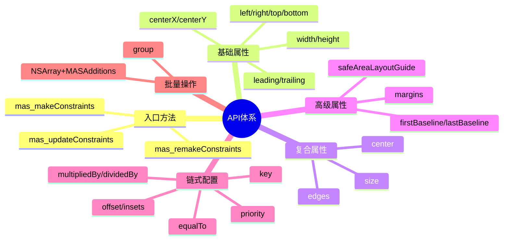
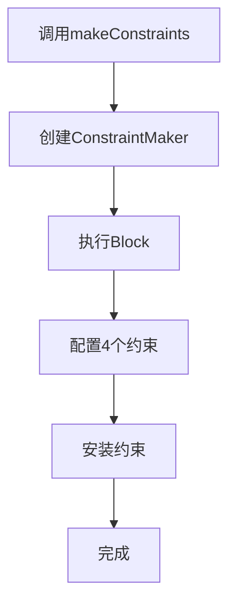
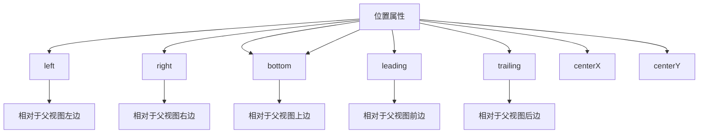

# 05_Masonry API 使用指南

## 🎯 本章目标
- 掌握 Masonry 的基础使用方法
- 学习高级技巧和最佳实践
- 理解与原生 Auto Layout 的对比
- 掌握常见场景的应用模式

---

## 📊 API 架构概览



---

## 🎯 基础使用

### 1. 创建约束 (makeConstraints)

```objective-c
// 基本示例
[view mas_makeConstraints:^(MASConstraintMaker *make) {
    make.left.equalTo(superview).offset(10);
    make.top.equalTo(superview).offset(20);
    make.width.mas_equalTo(100);
    make.height.mas_equalTo(50);
}];
```

**执行流程图**：


### 2. 更新约束 (updateConstraints)

```objective-c
// 动态更新
[view mas_updateConstraints:^(MASConstraintMaker *make) {
    make.left.offset(20);  // 只更新常量值
    make.width.offset(150);
}];
```

**特点**：
- ✅ 只更新已存在约束的常量
- ✅ 不创建新约束
- ✅ 性能更好

### 3. 重做约束 (remakeConstraints)

```objective-c
// 完全重置
[view mas_remakeConstraints:^(MASConstraintMaker *make) {
    make.edges.equalTo(superview).insets(UIEdgeInsetsMake(10, 10, 10, 10));
}];
```

**特点**：
- ✅ 移除所有旧约束
- ✅ 完全重新定义
- ✅ 适合布局切换

---

## 🔧 基础属性详解

### 位置属性



**使用示例**：
```objective-c
// 左上角
make.left.equalTo(superview).offset(10);
make.top.equalTo(superview).offset(10);

// 右下角（使用负偏移）
make.right.equalTo(superview).offset(-10);
make.bottom.equalTo(superview).offset(-10);

// 居中
make.centerX.equalTo(superview);
make.centerY.equalTo(superview);

// 国际化友好（leading/trailing）
make.leading.equalTo(superview).offset(10);
make.trailing.equalTo(superview).offset(-10);
```

### 尺寸属性

```objective-c
// 固定宽度
make.width.mas_equalTo(100);

// 固定高度
make.height.mas_equalTo(50);

// 与父视图等宽
make.width.equalTo(superview);

// 与父视图宽度比例
make.width.equalTo(superview).multipliedBy(0.5);  // 50%

// 与另一视图等宽
make.width.equalTo(otherView);

// 除法
make.width.equalTo(superview).dividedBy(2);  // 50%
```

**尺寸对比表**：
| 方法 | 示例 | 说明 |
|------|------|------|
| **固定值** | `make.width.mas_equalTo(100)` | 绝对尺寸 |
| **相对父视图** | `make.width.equalTo(superview)` | 等宽 |
| **比例** | `make.width.equalTo(superview).multipliedBy(0.5)` | 50%宽度 |
| **除法** | `make.width.equalTo(superview).dividedBy(2)` | 1/2宽度 |
| **其他视图** | `make.width.equalTo(otherView)` | 相等 |

---

## 🎨 复合属性

### edges (边距)

```objective-c
// 全边距
[view mas_makeConstraints:^(MASConstraintMaker *make) {
    make.edges.equalTo(superview).insets(UIEdgeInsetsMake(10, 10, 10, 10));
}];

// 等价于
make.top.equalTo(superview).offset(10);
make.left.equalTo(superview).offset(10);
make.bottom.equalTo(superview).offset(-10);
make.right.equalTo(superview).offset(-10);
```

**内部实现**：
```mermaid
flowchart TD
    A[make.edges] --> B[创建CompositeConstraint]
    B --> C[包含4个ViewConstraint]
    C --> D[top/left/bottom/right]
    D --> E[.insets(...)]
    E --> F[遍历设置偏移]
    F --> G[top: +10, left: +10, bottom: -10, right: -10]
```

### size (尺寸)

```objective-c
// 固定尺寸
[view mas_makeConstraints:^(MASConstraintMaker *make) {
    make.size.mas_equalTo(CGSizeMake(100, 100));
}];

// 等价于
make.width.mas_equalTo(100);
make.height.mas_equalTo(100);

// 相对尺寸
make.size.equalTo(superview).insets(UIEdgeInsetsMake(10, 10, 10, 10));
// 宽度 = superview.width - 20
// 高度 = superview.height - 20
```

### center (居中)

```objective-c
// 居中
[view mas_makeConstraints:^(MASConstraintMaker *make) {
    make.center.equalTo(superview);
}];

// 等价于
make.centerX.equalTo(superview);
make.centerY.equalTo(superview);

// 偏移居中
make.center.equalTo(superview).offset(CGPointMake(10, -10));
// centerX = superview.centerX + 10
// centerY = superview.centerY - 10
```

---

## 🚀 高级属性

### 安全区域 (Safe Area) - iOS 11+

```objective-c
// 安全区域顶部
make.top.equalTo(view.mas_safeAreaLayoutGuideTop);

// 安全区域底部
make.bottom.equalTo(view.mas_safeAreaLayoutGuideBottom);

// 安全区域全屏
make.edges.equalTo(view.mas_safeAreaLayoutGuide);
```

**适配方案**：
```objective-c
// 兼容iOS 11以下
if (@available(iOS 11.0, *)) {
    make.top.equalTo(view.mas_safeAreaLayoutGuideTop);
} else {
    make.top.equalTo(view);
}
```

### 基线对齐

```objective-c
// 第一行基线
make.firstBaseline.equalTo(label1.mas_firstBaseline);

// 最后一行基线
make.lastBaseline.equalTo(label2.mas_lastBaseline);

// 基线偏移
make.baseline.equalTo(label).offset(5);
```

### 边距属性 (iOS)

```objective-c
// 边距属性
make.leftMargin.equalTo(10);      // iOS: 左边距
make.rightMargin.equalTo(10);     // iOS: 右边距
make.topMargin.equalTo(10);       // iOS: 上边距
make.bottomMargin.equalTo(10);    // iOS: 下边距

// 安全区域边距
make.leftMargin.equalTo(view.mas_safeAreaLayoutGuideLeft).offset(10);
```

---

## 🔗 链式配置详解

### 关系运算符

```objective-c
// 等于 (默认)
make.left.equalTo(superview);

// 大于等于
make.width.greaterThanOrEqualTo(100);

// 小于等于
make.height.lessThanOrEqualTo(200);

// 组合使用
make.width.greaterThanOrEqualTo(100).lessThanOrEqualTo(200);
```

### 偏移配置

```objective-c
// 数值偏移
make.left.offset(10);           // +10
make.right.offset(-10);         // -10

// 点偏移 (center)
make.center.offset(CGPointMake(5, -5));

// 尺寸偏移
make.size.sizeOffset(CGSizeMake(10, -10));

// 边距偏移
make.edges.insets(UIEdgeInsetsMake(10, 10, 10, 10));
```

### 优先级

```objective-c
// 具体数值
make.width.equalTo(superview).priority(750);

// 预设值
make.width.equalTo(superview).priorityLow();     // 250
make.width.equalTo(superview).priorityMedium();  // 500
make.width.equalTo(superview).priorityHigh();    // 750

// 链式
make.left.equalTo(superview).priorityHigh().offset(10);
```

### 乘除运算

```objective-c
// 乘法
make.width.equalTo(superview).multipliedBy(0.5);    // 50%
make.height.equalTo(superview).multipliedBy(2);     // 200%

// 除法
make.width.equalTo(superview).dividedBy(3);         // 33.33%
make.height.equalTo(otherView).dividedBy(2);        // 50%

// 组合
make.width.equalTo(superview).multipliedBy(0.5).offset(10);
```

### 标识与调试

```objective-c
// 添加key用于调试
make.left.equalTo(superview).offset(10).key(@"leftConstraint");
make.top.equalTo(superview).offset(20).key(@"topConstraint");

// 后续查找
NSArray *constraints = [MASViewConstraint installedConstraintsForView:view];
for (MASViewConstraint *constraint in constraints) {
    if ([constraint.layoutConstraint.identifier isEqualToString:@"leftConstraint"]) {
        // 找到特定约束
    }
}
```

---

## 📦 批量操作

### NSArray+MASAdditions

```objective-c
// 1. 等宽排列
NSArray *views = @[view1, view2, view3];
[views mas_makeConstraints:^(MASConstraintMaker *make) {
    make.top.bottom.equalTo(superview);
    make.width.equalTo(superview).dividedBy(views.count);
}];

// 2. 水平分布
[views mas_distributeViewsAlongAxis:MASAxisTypeHorizontal
                    withFixedSpacing:10
                         leadSpacing:10
                         tailSpacing:10];

// 3. 垂直分布
[views mas_distributeViewsAlongAxis:MASAxisTypeVertical
                    withFixedSpacing:10
                         leadSpacing:10
                         tailSpacing:10];

// 4. 对齐顶部
[views mas_makeConstraints:^(MASConstraintMaker *make) {
    make.top.equalTo(superview);
}];
```

**分布函数详解**：
```objective-c
// 水平分布，固定间距
[views mas_distributeViewsAlongAxis:MASAxisTypeHorizontal
                    withFixedSpacing:10
                         leadSpacing:15
                         tailSpacing:20];

// 等价于：
// view1.left = superview.left + 15
// view2.left = view1.right + 10
// view3.left = view2.right + 10
// view3.right = superview.right - 20
```

### group 分组

```objective-c
// 创建约束组
MASConstraintMaker *maker = [[MASConstraintMaker alloc] initWithView:view];
MASConstraint *group = maker.group(^{
    make.left.equalTo(superview).offset(10);
    make.top.equalTo(superview).offset(20);
    make.width.mas_equalTo(100);
});

// 后续可以统一操作
[group uninstall];  // 卸载整个组
```

---

## 🎯 常见场景模式

### 场景1：子视图填充父视图

```objective-c
// 基础填充
[view mas_makeConstraints:^(MASConstraintMaker *make) {
    make.edges.equalTo(superview);
}];

// 带边距
[view mas_makeConstraints:^(MASConstraintMaker *make) {
    make.edges.equalTo(superview).insets(UIEdgeInsetsMake(10, 10, 10, 10));
}];

// 安全区域填充
[view mas_makeConstraints:^(MASConstraintMaker *make) {
    make.edges.equalTo(superview.mas_safeAreaLayoutGuide);
}];
```

### 场景2：视图居中

```objective-c
// 完全居中
[view mas_makeConstraints:^(MASConstraintMaker *make) {
    make.center.equalTo(superview);
}];

// 居中 + 固定尺寸
[view mas_makeConstraints:^(MASConstraintMaker *make) {
    make.center.equalTo(superview);
    make.size.mas_equalTo(CGSizeMake(200, 100));
}];

// 居中 + 相对尺寸
[view mas_makeConstraints:^(MASConstraintMaker *make) {
    make.center.equalTo(superview);
    make.width.equalTo(superview).multipliedBy(0.8);
    make.height.mas_equalTo(100);
}];
```

### 场景3：水平排列

```objective-c
// 三个等宽视图水平排列
[view1 mas_makeConstraints:^(MASConstraintMaker *make) {
    make.left.equalTo(superview).offset(10);
    make.top.bottom.equalTo(superview);
    make.width.equalTo(superview).dividedBy(3).offset(-10);
}];

[view2 mas_makeConstraints:^(MASConstraintMaker *make) {
    make.left.equalTo(view1.mas_right).offset(10);
    make.top.bottom.equalTo(superview);
    make.width.equalTo(view1);
}];

[view3 mas_makeConstraints:^(MASConstraintMaker *make) {
    make.left.equalTo(view2.mas_right).offset(10);
    make.top.bottom.equalTo(superview);
    make.width.equalTo(view1);
    make.right.equalTo(superview).offset(-10);
}];
```

### 场景4：垂直排列

```objective-c
// 头部、内容、底部
[header mas_makeConstraints:^(MASConstraintMaker *make) {
    make.left.right.top.equalTo(superview);
    make.height.mas_equalTo(60);
}];

[content mas_makeConstraints:^(MASConstraintMaker *make) {
    make.left.right.equalTo(superview);
    make.top.equalTo(header.mas_bottom).offset(10);
    make.bottom.equalTo(footer.mas_top).offset(-10);
}];

[footer mas_makeConstraints:^(MASConstraintMaker *make) {
    make.left.right.bottom.equalTo(superview);
    make.height.mas_equalTo(44);
}];
```

### 场景5：动态高度

```objective-c
// Label自适应高度
[label mas_makeConstraints:^(MASConstraintMaker *make) {
    make.left.equalTo(superview).offset(15);
    make.right.equalTo(superview).offset(-15);
    make.top.equalTo(superview).offset(20);
}];

// 内容视图根据Label高度
[contentView mas_makeConstraints:^(MASConstraintMaker *make) {
    make.left.right.equalTo(superview);
    make.top.equalTo(label.mas_bottom).offset(15);
    make.bottom.equalTo(superview).offset(-15);
}];
```

### 场景6：键盘响应

```objective-c
// 键盘弹出时调整底部约束
- (void)keyboardWillShow:(NSNotification *)notification {
    NSDictionary *userInfo = notification.userInfo;
    CGRect keyboardFrame = [userInfo[UIKeyboardFrameEndUserInfoKey] CGRectValue];
    CGFloat keyboardHeight = keyboardFrame.size.height;

    [self.view mas_updateConstraints:^(MASConstraintMaker *make) {
        make.bottom.equalTo(superview).offset(-keyboardHeight);
    }];

    [UIView animateWithDuration:0.3 animations:^{
        [self.view layoutIfNeeded];
    }];
}

- (void)keyboardWillHide {
    [self.view mas_updateConstraints:^(MASConstraintMaker *make) {
        make.bottom.equalTo(superview);
    }];

    [UIView animateWithDuration:0.3 animations:^{
        [self.view layoutIfNeeded];
    }];
}
```

### 场景7：动画过渡

```objective-c
// 约束动画
[UIView animateWithDuration:0.5 animations:^{
    [self.expandedView mas_updateConstraints:^(MASConstraintMaker *make) {
        make.height.mas_equalTo(300);
        make.width.equalTo(superview).multipliedBy(0.9);
    }];
    [self.view layoutIfNeeded];  // 关键：触发布局更新
}];
```

### 场景8：条件布局

```objective-c
// 根据状态切换布局
- (void)updateLayoutForState:(BOOL)isExpanded {
    if (isExpanded) {
        [self.view mas_remakeConstraints:^(MASConstraintMaker *make) {
            make.edges.equalTo(superview);
        }];
    } else {
        [self.view mas_remakeConstraints:^(MASConstraintMaker *make) {
            make.left.right.equalTo(superview);
            make.top.equalTo(superview).offset(100);
            make.height.mas_equalTo(200);
        }];
    }

    [UIView animateWithDuration:0.3 animations:^{
        [self.view layoutIfNeeded];
    }];
}
```

---

## 🔄 与原生 Auto Layout 对比

### 代码对比

```objective-c
// Masonry
[view mas_makeConstraints:^(MASConstraintMaker *make) {
    make.left.equalTo(superview).offset(10);
    make.top.equalTo(superview).offset(20);
    make.width.mas_equalTo(100);
    make.height.mas_equalTo(50);
}];

// 原生 NSLayoutConstraints
view.translatesAutoresizingMaskIntoConstraints = NO;
[NSLayoutConstraint activateConstraints:@[
    [NSLayoutConstraint constraintWithItem:view
                                 attribute:NSLayoutAttributeLeft
                                 relatedBy:NSLayoutRelationEqual
                                    toItem:superview
                                 attribute:NSLayoutAttributeLeft
                                multiplier:1.0
                                  constant:10],
    [NSLayoutConstraint constraintWithItem:view
                                 attribute:NSLayoutAttributeTop
                                 relatedBy:NSLayoutRelationEqual
                                    toItem:superview
                                 attribute:NSLayoutAttributeTop
                                multiplier:1.0
                                  constant:20],
    [NSLayoutConstraint constraintWithItem:view
                                 attribute:NSLayoutAttributeWidth
                                 relatedBy:NSLayoutRelationEqual
                                    toItem:nil
                                 attribute:NSLayoutAttributeNotAnAttribute
                                multiplier:1.0
                                  constant:100],
    [NSLayoutConstraint constraintWithItem:view
                                 attribute:NSLayoutAttributeHeight
                                 relatedBy:NSLayoutRelationEqual
                                    toItem:nil
                                 attribute:NSLayoutAttributeNotAnAttribute
                                multiplier:1.0
                                  constant:50]
]];
```

### 优势对比表

| 特性 | Masonry | 原生 Auto Layout |
|------|---------|------------------|
| **代码量** | ⭐⭐⭐⭐⭐ 极少 | ⭐⭐ 较多 |
| **可读性** | ⭐⭐⭐⭐⭐ 链式流畅 | ⭐⭐ 冗长 |
| **类型安全** | ⭐⭐⭐⭐ 自动装箱 | ⭐⭐⭐⭐ 类型明确 |
| **调试** | ⭐⭐⭐ 支持key | ⭐⭐⭐⭐ 原生支持 |
| **学习曲线** | ⭐⭐⭐⭐⭐ 简单 | ⭐⭐⭐ 需要理解 |
| **扩展性** | ⭐⭐⭐⭐⭐ 易扩展 | ⭐⭐⭐ 标准API |
| **性能** | ⭐⭐⭐⭐ 无额外开销 | ⭐⭐⭐⭐⭐ 原生最优 |

### 适用场景

**推荐使用 Masonry**：
- ✅ 快速原型开发
- ✅ 复杂约束关系
- ✅ 动态约束更新
- ✅ 团队协作（代码更清晰）

**推荐使用原生**：
- ✅ 性能极致要求
- ✅ 需要精确控制
- ✅ 调试复杂问题
- ✅ 与系统框架深度集成

---

## ⚠️ 常见陷阱与解决方案

### 陷阱1：视图未添加到父视图

```objective-c
// ❌ 错误
UIView *view = [[UIView alloc] init];
[view mas_makeConstraints:^(MASConstraintMaker *make) {
    make.edges.equalTo(superview);  // superview为nil
}];

// ✅ 正确
[superview addSubview:view];
[view mas_makeConstraints:^(MASConstraintMaker *make) {
    make.edges.equalTo(superview);
}];
```

### 陷阱2：重复添加相同约束

```objective-c
// ❌ 错误（多次调用makeConstraints）
[view mas_makeConstraints:^(MASConstraintMaker *make) {
    make.left.offset(10);
}];
[view mas_makeConstraints:^(MASConstraintMaker *make) {
    make.left.offset(20);  // 冲突！
}];

// ✅ 正确（使用updateConstraints）
[view mas_makeConstraints:^(MASConstraintMaker *make) {
    make.left.offset(10);
}];
[view mas_updateConstraints:^(MASConstraintMaker *make) {
    make.left.offset(20);  // 更新，不冲突
}];
```

### 陷阱3：循环引用

```objective-c
// ❌ 错误（block中强引用self）
[self.view mas_makeConstraints:^(MASConstraintMaker *make) {
    make.edges.equalTo(self.view);  // self被block强引用
}];

// ✅ 正确（使用弱引用）
__weak typeof(self) weakSelf = self;
[self.view mas_makeConstraints:^(MASConstraintMaker *make) {
    make.edges.equalTo(weakSelf.view);
}];
```

### 陷阱4：约束优先级冲突

```objective-c
// ❌ 可能冲突
make.width.equalTo(superview).priorityHigh();
make.width.mas_equalTo(100).priorityHigh();  // 两个高优先级约束

// ✅ 明确优先级
make.width.equalTo(superview).priority(750);
make.width.mas_equalTo(100).priority(250);  // 一个高，一个低
```

### 陷阱5：安全区域兼容性

```objective-c
// ❌ iOS 10以下崩溃
make.top.equalTo(view.mas_safeAreaLayoutGuideTop);

// ✅ 兼容处理
if (@available(iOS 11.0, *)) {
    make.top.equalTo(view.mas_safeAreaLayoutGuideTop);
} else {
    make.top.equalTo(view);
}
```

---

## 🎓 本章要点总结

### 核心API
1. **入口方法**：make/update/remake 三种策略
2. **基础属性**：left/right/top/bottom/width/height
3. **复合属性**：edges/size/center
4. **链式配置**：equalTo/offset/priority/multipliedBy

### 使用模式
- **填充**：edges.equalTo(superview)
- **居中**：center.equalTo(superview)
- **排列**：distributeViewsAlongAxis
- **更新**：updateConstraints
- **重置**：remakeConstraints

### 最佳实践
- ✅ 优先使用 updateConstraints 更新约束
- ✅ 使用 remakeConstraints 处理布局切换
- ✅ 为约束添加 key 便于调试
- ✅ 注意循环引用和内存管理
- ✅ 处理 iOS 版本兼容性

---

**下一章**：[06_最佳实践](06_最佳实践.md)

**上一章**：[04_生命周期流程](04_生命周期流程.md)

**返回目录**：[README](../README.md)