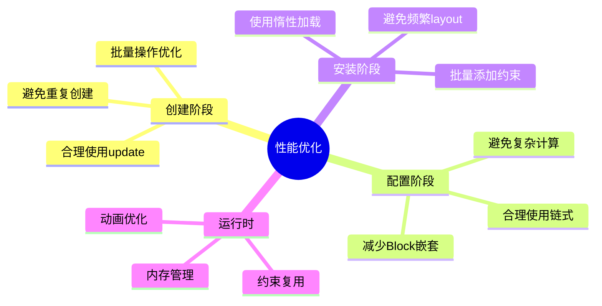
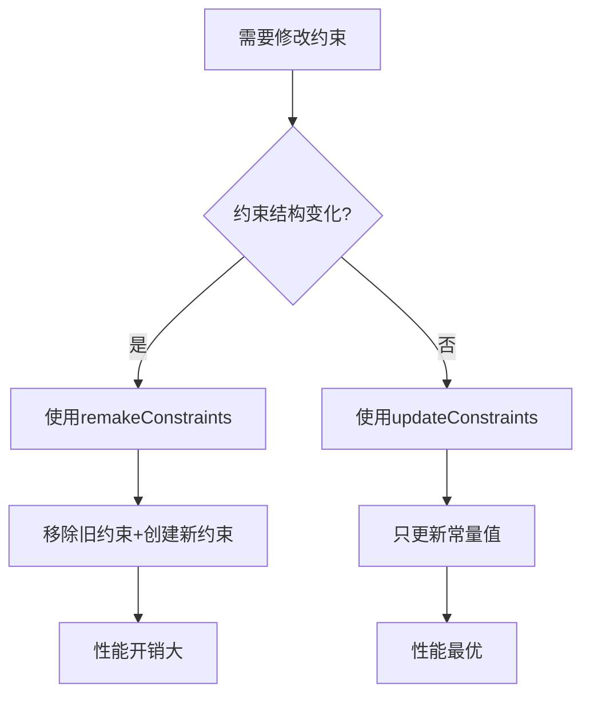

# 06_Masonry 最佳实践与性能优化

## 🎯 本章目标
- 掌握性能优化的关键技术
- 学习内存管理和循环引用防护
- 了解调试和监控技巧
- 掌握扩展和定制方法

---

## 📊 性能优化层次



---

## 🚀 创建性能优化

### 1. 避免重复创建约束

```objective-c
// ❌ 性能问题：每次调用都创建新约束
- (void)layoutSubviews {
    [super layoutSubviews];
    [self.label mas_makeConstraints:^(MASConstraintMaker *make) {  // 每次都会创建！
        make.edges.equalTo(self);
    }];
}

// ✅ 优化方案：只创建一次
@interface MyView ()
@property (nonatomic, strong) UILabel *label;
@property (nonatomic, assign) BOOL hasSetupConstraints;
@end

@implementation MyView

- (void)updateConstraints {
    if (!self.hasSetupConstraints) {
        [self setupConstraints];
        self.hasSetupConstraints = YES;
    }
    [super updateConstraints];
}

- (void)setupConstraints {
    [self.label mas_makeConstraints:^(MASConstraintMaker *make) {
        make.edges.equalTo(self);
    }];
}

@end
```

### 2. 合理使用 update vs remake



**性能对比**：
```objective-c
// 场景1：只改常量（推荐update）
- (void)updateWidth:(CGFloat)width {
    [self.view mas_updateConstraints:^(MASConstraintMaker *make) {
        make.width.offset(width);  // 只更新constant
    }];
}

// 场景2：改变布局结构（必须remake）
- (void)switchToVerticalLayout {
    [self.view mas_remakeConstraints:^(MASConstraintMaker *make) {
        make.top.left.right.equalTo(superview);
        make.height.mas_equalTo(200);
    }];
}

// 场景3：混合情况
- (void)updateLayout:(BOOL)isVertical {
    if (isVertical) {
        [self.view mas_remakeConstraints:^(MASConstraintMaker *make) {
            make.top.left.right.equalTo(superview);
            make.height.mas_equalTo(200);
        }];
    } else {
        [self.view mas_updateConstraints:^(MASConstraintMaker *make) {
            make.left.right.equalTo(superview);
            make.top.offset(10);
            make.height.offset(100);
        }];
    }
}
```

### 3. 批量操作优化

```objective-c
// ❌ 低效：多次遍历
for (UIView *view in subviews) {
    [view mas_makeConstraints:^(MASConstraintMaker *make) {
        make.width.equalTo(superview).dividedBy(5);
    }];
}

// ✅ 高效：单次遍历
[subviews mas_makeConstraints:^(MASConstraintMaker *make) {
    make.width.equalTo(superview).dividedBy(5);
    make.top.bottom.equalTo(superview);
}];

// ✅ 高级：分布函数
[subviews mas_distributeViewsAlongAxis:MASAxisTypeHorizontal
                    withFixedSpacing:10
                         leadSpacing:10
                         tailSpacing:10];

[subviews mas_makeConstraints:^(MASConstraintMaker *make) {
    make.top.bottom.equalTo(superview);
}];
```

---

## 💾 内存管理最佳实践

### 1. 防止循环引用

```objective-c
// ❌ 危险：强引用循环
@implementation MyViewController

- (void)viewDidLoad {
    [super viewDidLoad];

    [self.view mas_makeConstraints:^(MASConstraintMaker *make) {  // Block强引用self
        make.edges.equalTo(self.view);                // self又被Block引用
    }];
}

@end

// ✅ 安全：弱引用
@implementation MyViewController

- (void)viewDidLoad {
    [super viewDidLoad];

    __weak typeof(self) weakSelf = self;
    [self.view mas_makeConstraints:^(MASConstraintMaker *make) {
        __strong typeof(weakSelf) strongSelf = weakSelf;
        if (!strongSelf) return;
        make.edges.equalTo(strongSelf.view);
    }];
}

@end

// ✅ 更简单：只捕获需要的视图
@implementation MyViewController

- (void)viewDidLoad {
    [super viewDidLoad];

    UIView *view = self.view;  // 局部变量
    [view mas_makeConstraints:^(MASConstraintMaker *make) {
        make.edges.equalTo(view);  // 只引用view，不引用self
    }];
}

@end
```

### 2. 约束内存管理

```objective-c
// ✅ Masonry自动管理约束对象
- (void)setupConstraints {
    // 约束被系统持有，无需手动释放
    [self.view mas_makeConstraints:^(MASConstraintMaker *make) {
        make.edges.equalTo(superview);
    }];
}

// ✅ 存储约束用于后续更新
@interface MyView ()
@property (nonatomic, strong) NSArray *constraints;  // 存储约束
@end

@implementation MyView

- (void)updateConstraints {
    if (!self.constraints) {
        self.constraints = [self mas_makeConstraints:^(MASConstraintMaker *make) {
            make.left.top.right.equalTo(superview);
            make.height.mas_equalTo(100);
        }];
    }
    [super updateConstraints];
}

@end
```

### 3. 避免内存泄漏

```objective-c
// ❌ 陷阱：NSString闭包捕获
[self.label mas_makeConstraints:^(MASConstraintMaker *make) {
    make.top.equalTo(self.view).offset([self calculateOffset]);
}];

- (CGFloat)calculateOffset {
    // 复杂计算，可能持有self
    return self.dataModel.offset;
}

// ✅ 优化：提前计算
CGFloat offset = [self calculateOffset];  // 局部变量
[self.label mas_makeConstraints:^(MASConstraintMaker *make) {
    make.top.equalTo(self.view).offset(offset);  // 只捕获基本类型
}];
```

---

## 🔍 调试与监控

### 1. 约束调试技巧

```objective-c
// 方法1：添加可视化标识
[view mas_makeConstraints:^(MASConstraintMaker *make) {
    make.edges.equalTo(superview).insets(UIEdgeInsetsMake(10, 10, 10, 10));
    make.left.key(@"myLeftConstraint");
    make.top.key(@"myTopConstraint");
}];

// 方法2：运行时查看约束
- (void)debugConstraints {
    NSArray *installed = [MASViewConstraint installedConstraintsForView:self.view];
    for (MASViewConstraint *constraint in installed) {
        NSLog(@"Constraint: %@", constraint.layoutConstraint);
        NSLog(@"  First: %@.%ld",
              constraint.firstViewAttribute.view,
              (long)constraint.firstViewAttribute.layoutAttribute);
        NSLog(@"  Second: %@", constraint.secondViewAttribute);
    }
}

// 方法3：检查约束冲突
- (void)checkConflicts {
    NSArray *constraints = self.view.constraints;
    NSMutableDictionary *attributeCount = [NSMutableDictionary dictionary];

    for (NSLayoutConstraint *constraint in constraints) {
        if (constraint.firstItem == self.view) {
            NSNumber *attr = @(constraint.firstAttribute);
            attributeCount[attr] = @(attributeCount[attr].integerValue + 1);
        }
    }

    for (NSNumber *attr in attributeCount) {
        if (attributeCount[attr].integerValue > 1) {
            NSLog(@"⚠️ 冲突警告：视图有多个%ld属性约束", (long)attr.integerValue);
        }
    }
}
```

### 2. 性能监控

```objective-c
// 监控约束创建耗时
#import <mach/mach_time.h>

- (void)benchmarkConstraints {
    mach_timebase_info_data_t info;
    mach_timebase_info(&info);

    uint64_t start = mach_absolute_time();

    // 执行约束创建
    [self.view mas_makeConstraints:^(MASConstraintMaker *make) {
        make.left.right.equalTo(superview);
        make.top.equalTo(superview).offset(10);
        make.height.mas_equalTo(200);
    }];

    uint64_t end = mach_absolute_time();
    uint64_t elapsed = (end - start) * info.numer / info.denom;

    NSLog(@"约束创建耗时: %llu ns", elapsed);
}

// 使用CADisplayLink监控FPS
- (void)setupPerformanceMonitor {
    CADisplayLink *link = [CADisplayLink displayLinkWithTarget:self selector:@selector(updateFPS:)];
    [link addToRunLoop:[NSRunLoop mainRunLoop] forMode:NSRunLoopCommonModes];
}

- (void)updateFPS:(CADisplayLink *)link {
    // 监控频繁的布局更新
    if (link.timestamp - self.lastUpdateTime < 0.016) {
        NSLog(@"⚠️ 过于频繁的布局更新");
    }
    self.lastUpdateTime = link.timestamp;
}
```

### 3. 内存泄漏检测

```objective-c
// 检查循环引用
- (void)checkMemoryLeak {
    // 1. 检查视图层级
    NSLog(@"View hierarchy: %@", [self.view performSelector:@selector(recursiveDescription)]);

    // 2. 检查约束引用
    NSArray *constraints = [MASViewConstraint installedConstraintsForView:self.view];
    for (MASViewConstraint *constraint in constraints) {
        // 确保视图是weak引用
        if (constraint.firstViewAttribute.view != self.view) {
            NSLog(@"⚠️ 可能的内存泄漏: 约束持有非预期视图");
        }
    }
}
```

---

## 🎨 动画性能优化

### 1. 约束动画最佳实践

```objective-c
// ✅ 正确的动画方式
- (void)animateLayoutChange {
    // 1. 更新约束
    [self.animatedView mas_updateConstraints:^(MASConstraintMaker *make) {
        make.height.mas_equalTo(300);
        make.width.equalTo(superview).multipliedBy(0.9);
    }];

    // 2. 触发布局更新
    [self.view setNeedsLayout];
    [self.view layoutIfNeeded];  // 关键：强制立即布局

    // 3. 执行动画
    [UIView animateWithDuration:0.5
                          delay:0
                        options:UIViewAnimationOptionCurveEaseInOut
                     animations:^{
                         [self.view layoutIfNeeded];  // 在动画块中再次调用
                     }
                     completion:nil];
}

// ❌ 错误的方式：直接修改frame
- (void)wrongAnimation {
    [UIView animateWithDuration:0.5 animations:^{
        // 这会与约束冲突
        self.view.frame = CGRectMake(0, 0, 200, 300);
    }];
}
```

### 2. 隐式动画优化

```objective-c
// ✅ 使用CATransaction包装多次约束更新
- (void)batchUpdateWithAnimation {
    [CATransaction begin];
    [CATransaction setAnimationDuration:0.3];

    [self.view1 mas_updateConstraints:^(MASConstraintMaker *make) {
        make.left.offset(20);
    }];

    [self.view2 mas_updateConstraints:^(MASConstraintMaker *make) {
        make.right.offset(-20);
    }];

    [self.view3 mas_updateConstraints:^(MASConstraintMaker *make) {
        make.width.equalTo(self.view1).multipliedBy(1.5);
    }];

    [CATransaction commit];
}
```

### 3. 离屏渲染优化

```objective-c
// ❌ 可能导致离屏渲染
[view mas_makeConstraints:^(MASConstraintMaker *make) {
    make.edges.equalTo(superview).insets(UIEdgeInsetsMake(20, 20, 20, 20));
}];
view.layer.cornerRadius = 10;
view.layer.masksToBounds = YES;

// ✅ 优化：减少修剪
[view mas_makeConstraints:^(MASConstraintMaker *make) {
    make.left.equalTo(superview).offset(20);
    make.right.equalTo(superview).offset(-20);
    make.top.equalTo(superview).offset(20);
    make.bottom.equalTo(superview).offset(-20);
}];
// 避免maskToBounds，使用CAShapeLayer或预先裁剪图片
```

---

## 🔧 扩展与定制

### 1. 自定义约束属性

```objective-c
// 为MASConstraintMaker添加新属性
@interface MASConstraintMaker (Custom)

@property (nonatomic, strong, readonly) MASConstraint *centerInContainer;
@property (nonatomic, strong, readonly) MASConstraint *floatTop;

@end

@implementation MASConstraintMaker (Custom)

- (MASConstraint *)centerInContainer {
    return [self addConstraintWithAttributes:MASAttributeCenterX | MASAttributeCenterY];
}

- (MASConstraint *)floatTop {
    // 固定距离顶部，可浮动
    MASViewConstraint *constraint = [[MASViewConstraint alloc]
                                     initWithFirstViewAttribute:self.view.mas_top];
    constraint.offset = 20;
    constraint.priority = MASLayoutPriorityDefaultHigh;
    [self.constraints addObject:constraint];
    return constraint;
}

@end

// 使用
[view mas_makeConstraints:^(MASConstraintMaker *make) {
    make.centerInContainer;
    make.size.mas_equalTo(CGSizeMake(100, 100));
}];
```

### 2. 链式扩展

```objective-c
// 自定义链式方法
@implementation MASConstraint (Custom)

- (MASConstraint * (^)(void))dashedBorder {
    return ^id{
        // 为视图添加虚线边框
        if ([self isKindOfClass:MASViewConstraint.class]) {
            MASViewConstraint *viewConstraint = (MASViewConstraint *)self;
            UIView *view = viewConstraint.firstViewAttribute.view;

            CAShapeLayer *border = [CAShapeLayer layer];
            border.strokeColor = [UIColor blackColor].CGColor;
            border.fillColor = nil;
            border.lineDashPattern = @[@4, @4];
            border.lineWidth = 1;
            [view.layer addSublayer:border];
        }
        return self;
    };
}

@end

// 使用
[view mas_makeConstraints:^(MASConstraintMaker *make) {
    make.edges.equalTo(superview);
    make.dashedBorder();  // 自定义功能
}];
```

### 3. 条件约束组

```objective-c
// 创建可切换的约束组
@interface LayoutGroup : NSObject
@property (nonatomic, strong) NSArray *constraints;
- (void)activate;
- (void)deactivate;
@end

@implementation LayoutGroup

- (void)activate {
    for (MASConstraint *constraint in self.constraints) {
        [constraint install];
    }
}

- (void)deactivate {
    for (MASConstraint *constraint in self.constraints) {
        [constraint uninstall];
    }
}

@end

// 使用
- (void)setupLayout {
    // 横屏约束组
    self.landscapeGroup = [[LayoutGroup alloc] init];
    self.landscapeGroup.constraints = [self mas_makeConstraints:^(MASConstraintMaker *make) {
        make.left.right.equalTo(superview);
        make.top.bottom.equalTo(superview);
    }];

    // 竖屏约束组
    self.portraitGroup = [[LayoutGroup alloc] init];
    self.portraitGroup.constraints = [self mas_makeConstraints:^(MASConstraintMaker *make) {
        make.left.right.equalTo(superview);
        make.top.offset(64);
        make.height.mas_equalTo(400);
    }];
}

- (void)traitCollectionDidChange:(UITraitCollection *)previousTraitCollection {
    [super traitCollectionDidChange:previousTraitCollection];

    if (self.traitCollection.horizontalSizeClass == UIUserInterfaceSizeClassCompact) {
        [self.portraitGroup deactivate];
        [self.landscapeGroup activate];
    } else {
        [self.landscapeGroup deactivate];
        [self.portraitGroup activate];
    }
}
```

---

## 🛡️ 安全与容错

### 1. 空值保护

```objective-c
// ✅ 安全的约束创建
- (void)safeConstraints {
    if (!self.view || !self.superview) {
        NSLog(@"⚠️ 视图未准备好，跳过约束创建");
        return;
    }

    [self.view mas_makeConstraints:^(MASConstraintMaker *make) {
        if (self.superview) {
            make.edges.equalTo(self.superview);
        }
        if (self.customWidth > 0) {
            make.width.mas_equalTo(self.customWidth);
        }
    }];
}
```

### 2. 约束冲突处理

```objective-c
// ✅ 冲突检测与处理
- (void)addSafeConstraint:(void(^)(MASConstraintMaker *))block {
    @try {
        [self.view mas_makeConstraints:block];
    } @catch (NSException *exception) {
        NSLog(@"约束创建失败: %@", exception);
        // 降级处理：使用自动布局或frame
        [self fallbackToFrameLayout];
    }
}
```

### 3. 版本兼容处理

```objective-c
// ✅ 完整的iOS版本兼容
- (void)setupCompatibleConstraints {
    if (@available(iOS 11.0, *)) {
        // 使用安全区域
        [self.view mas_makeConstraints:^(MASConstraintMaker *make) {
            make.edges.equalTo(self.view.mas_safeAreaLayoutGuide);
        }];
    } else {
        // 降级方案
        [self.view mas_makeConstraints:^(MASConstraintMaker *make) {
            make.left.right.equalTo(superview);
            make.top.equalTo(superview).offset(20);  // 状态栏高度
            make.bottom.equalTo(superview);
        }];
    }
}
```

---

## 📈 性能测试与基准

### 1. 约束创建基准测试

```objective-c
@interface BenchmarkTool : NSObject
+ (void)benchmarkConstraintCreation:(dispatch_block_t)block iterations:(NSUInteger)iterations;
@end

@implementation BenchmarkTool

+ (void)benchmarkConstraintCreation:(dispatch_block_t)block iterations:(NSUInteger)iterations {
    CFTimeInterval start = CACurrentMediaTime();

    for (NSUInteger i = 0; i < iterations; i++) {
        @autoreleasepool {
            block();
        }
    }

    CFTimeInterval end = CACurrentMediaTime();
    CFTimeInterval average = (end - start) / iterations;

    NSLog(@"平均创建时间: %.3f ms", average * 1000);
    NSLog(@"总耗时: %.3f ms", (end - start) * 1000);
}

@end

// 使用
[BenchmarkTool benchmarkConstraintCreation:^{
    UIView *view = [[UIView alloc] init];
    [view mas_makeConstraints:^(MASConstraintMaker *make) {
        make.edges.equalTo(superview);
    }];
} iterations:1000];
```

### 2. 内存占用测试

```objective-c
- (void)testMemoryUsage {
    // 创建100个视图和约束
    NSMutableArray *views = [NSMutableArray array];
    for (int i = 0; i < 100; i++) {
        UIView *view = [[UIView alloc] init];
        [views addObject:view];

        [view mas_makeConstraints:^(MASConstraintMaker *make) {
            make.left.right.top.bottom.equalTo(superview);
            make.width.mas_equalTo(100 + i);
            make.height.mas_equalTo(100 + i);
        }];
    }

    // 检查内存
    NSLog(@"当前内存: %.2f MB", [self getMemoryUsage]);
}

- (float)getMemoryUsage {
    struct mach_task_basic_info info;
    mach_msg_type_number_t size = MACH_TASK_BASIC_INFO_COUNT;
    kern_return_t kerr = task_info(mach_task_self(),
                                   MACH_TASK_BASIC_INFO,
                                   (task_info_t)&info,
                                   &size);
    return kerr == KERN_SUCCESS ? info.resident_size / 1024.0 / 1024.0 : 0;
}
```

---

## 🎓 本章要点总结

### 性能优化原则
1. **减少创建**：避免重复创建约束，使用update代替make
2. **降低复杂度**：简化Block，减少嵌套
3. **批量操作**：使用数组方法和分布函数
4. **内存安全**：弱引用防止循环泄漏
5. **动画优化**：正确使用layoutIfNeeded

### 调试技巧
- ✅ 添加key标识约束
- ✅ 监控约束冲突
- ✅ 检查内存泄漏
- ✅ 性能基准测试

### 安全实践
- ✅ 空值保护
- ✅ 版本兼容
- ✅ 异常处理
- ✅ 降级方案

### 最佳实践清单
```
□ 使用updateConstraints更新常量
□ 使用remakeConstraints切换布局
□ 弱引用Block捕获
□ 批量创建约束
□ 添加调试key
□ 监控内存使用
□ 处理iOS版本差异
□ 避免在layoutSubviews中创建约束
□ 动画使用layoutIfNeeded
□ 定期检查约束冲突
```

---

**下一章**：[07_源码深度解析](07_源码深度解析.md)

**上一章**：[05_API使用指南](05_API使用指南.md)

**返回目录**：[README](../README.md)