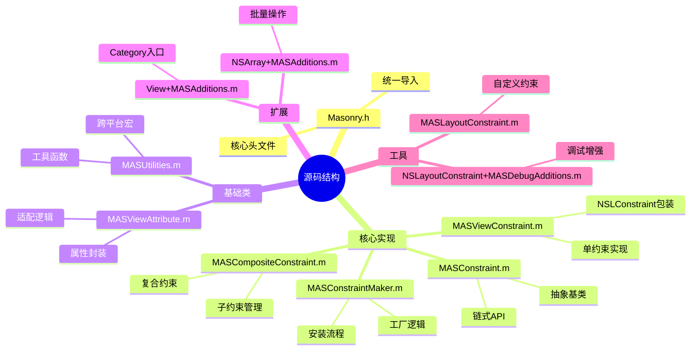
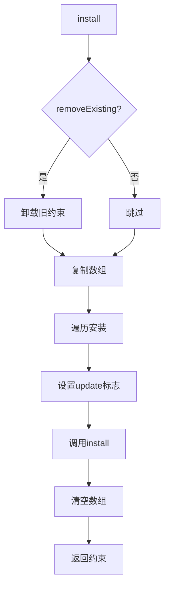
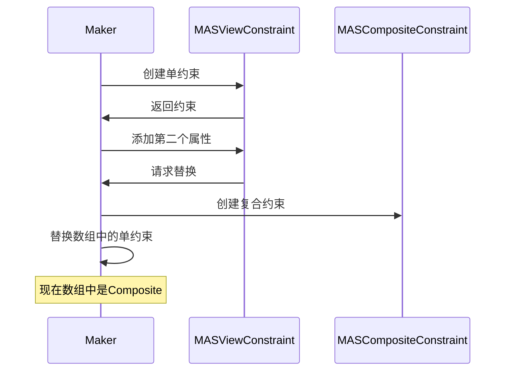
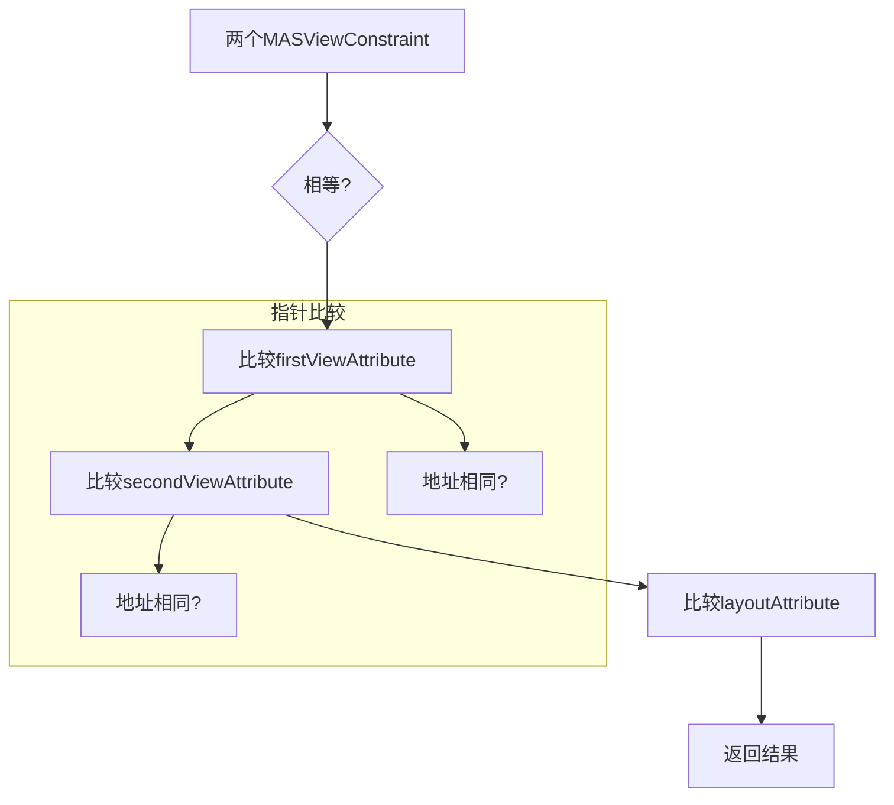
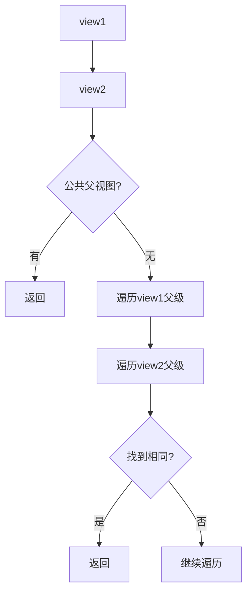
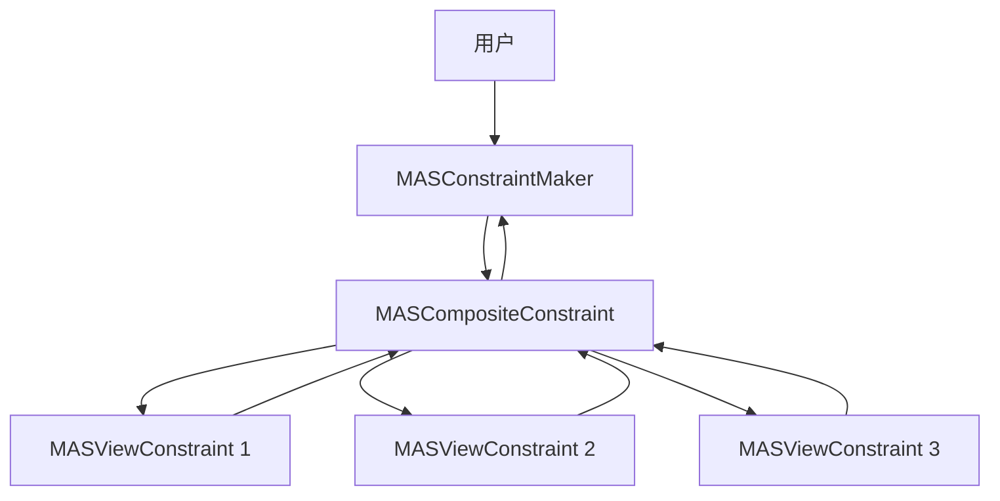
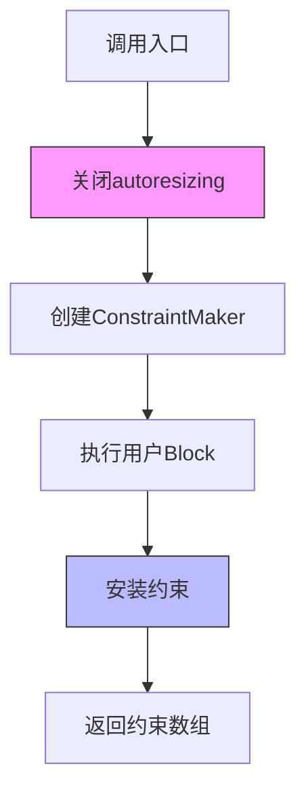
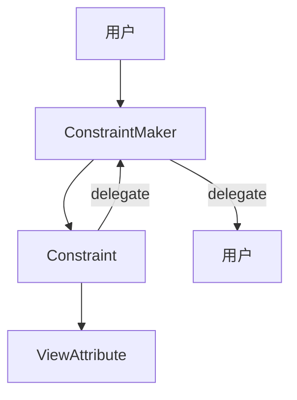

# 07_Masonry 源码深度解析

## 🎯 本章目标
- 逐行解析核心源码实现
- 理解关键算法的设计思路
- 学习高质量代码的编写技巧
- 掌握可扩展架构的设计方法

---

## 📊 源码结构概览



---

## 🔍 MASConstraintMaker.m 深度解析

### 1. 初始化过程

```objective-c
// MASConstraintMaker.m:25
- (id)initWithView:(MAS_VIEW *)view {
    self = [super init];
    if (!self) return nil;

    self.view = view;
    self.constraints = NSMutableArray.new;

    return self;
}
```

**设计要点**：
- ✅ **弱引用视图**：`@property (nonatomic, weak) MAS_VIEW *view;`
  - 避免循环引用：View → Maker → View
  - Maker生命周期由用户Block控制

- ✅ **惰性初始化数组**：使用 `NSMutableArray.new` 而非懒加载
  - 简化代码，无额外开销
  - 确保每次创建都是干净状态

### 2. 安装流程详解

```objective-c
// MASConstraintMaker.m:35
- (NSArray *)install {
    // 1. 处理重做模式
    if (self.removeExisting) {
        NSArray *installedConstraints = [MASViewConstraint installedConstraintsForView:self.view];
        for (MASConstraint *constraint in installedConstraints) {
            [constraint uninstall];
        }
    }

    // 2. 防御性复制
    NSArray *constraints = self.constraints.copy;

    // 3. 批量安装
    for (MASConstraint *constraint in constraints) {
        constraint.updateExisting = self.updateExisting;
        [constraint install];
    }

    // 4. 清理现场
    [self.constraints removeAllObjects];

    return constraints;
}
```

**关键设计**：


**防御性复制的意义**：
```objective-c
// ❌ 危险：直接遍历
for (MASConstraint *constraint in self.constraints) {
    [constraint install];
    // 如果constraint.install内部修改了self.constraints，会导致崩溃
}

// ✅ 安全：先复制
NSArray *constraints = self.constraints.copy;  // 创建不可变副本
for (MASConstraint *constraint in constraints) {
    [constraint install];  // 安全遍历
}
```

### 3. 代理方法实现

```objective-c
// MASConstraintMaker.m:53
- (void)constraint:(MASConstraint *)constraint
    shouldBeReplacedWithConstraint:(MASConstraint *)replacementConstraint {

    NSUInteger index = [self.constraints indexOfObject:constraint];
    NSAssert(index != NSNotFound, @"Could not find constraint %@", constraint);

    [self.constraints replaceObjectAtIndex:index withObject:replacementConstraint];
}
```

**使用场景**：


```objective-c
// MASConstraintMaker.m:59
- (MASConstraint *)constraint:(MASConstraint *)constraint
    addConstraintWithLayoutAttribute:(NSLayoutAttribute)layoutAttribute {

    // 创建新约束
    MASViewAttribute *viewAttribute = [[MASViewAttribute alloc]
                                       initWithView:self.view
                                       layoutAttribute:layoutAttribute];
    MASViewConstraint *newConstraint = [[MASViewConstraint alloc]
                                        initWithFirstViewAttribute:viewAttribute];

    // 单约束 → 复合约束的升级
    if ([constraint isKindOfClass:MASViewConstraint.class]) {
        NSArray *children = @[constraint, newConstraint];
        MASCompositeConstraint *compositeConstraint = [[MASCompositeConstraint alloc]
                                                       initWithChildren:children];
        compositeConstraint.delegate = self;

        // 通过代理替换
        [self constraint:constraint shouldBeReplacedWithConstraint:compositeConstraint];
        return compositeConstraint;
    }

    // 无约束时直接添加
    if (!constraint) {
        newConstraint.delegate = self;
        [self.constraints addObject:newConstraint];
    }

    return newConstraint;
}
```

**升级流程**：
```
make.left → MASViewConstraint
  ↓
make.left.right → MASCompositeConstraint
  ↓
  包含: [MASViewConstraint(left), MASViewConstraint(right)]
```

---

## 🔍 MASConstraint.m 深度解析

### 1. 链式API的魔法

```objective-c
// MASConstraint.m:25
- (MASConstraint * (^)(MASEdgeInsets))insets {
    return ^id(MASEdgeInsets insets) {
        // 子类实现具体逻辑
        return self;  // 关键：返回self实现链式
    };
}
```

**为什么能链式调用？**
```objective-c
// 执行过程
make.left.equalTo(superview).offset(10).priorityHigh();

// 1. make.left → 返回MASViewConstraint实例
// 2. .equalTo(superview) → 配置，返回self（同一个实例）
// 3. .offset(10) → 配置，返回self
// 4. .priorityHigh() → 配置，返回self
// 5. 结束 → self被丢弃，约束已配置完成
```

### 2. 抽象与多态

```objective-c
// MASConstraint.m:209
- (void)install {
    // 抛出异常，强制子类实现
    [NSException raise:NSInternalInconsistencyException
                format:@"You must override %@ in a subclass", NSStringFromSelector(_cmd)];
}

// MASConstraint.m:214
- (void)uninstall {
    [NSException raise:NSInternalInconsistencyException
                format:@"You must override %@ in a subclass", NSStringFromSelector(_cmd)];
}
```

**多态的优势**：
```objective-c
// 客户端代码无需知道具体类型
MASConstraint *constraint = make.left;  // 可能是View或Composite

// 统一接口调用
[constraint install];  // 自动调用正确的实现
```

### 3. 自动装箱支持

```objective-c
// MASConstraint.m:235
#define mas_equalTo(...)                 equalTo(MASBoxValue((__VA_ARGS__)))
#define mas_offset(...)                  valueOffset(MASBoxValue((__VA_ARGS__)))

// MASConstraint.m:253
- (MASConstraint * (^)(id))mas_equalTo {
    return ^id(id attr) {
        return self.equalTo(attr);
    };
}
```

**MASBoxValue 宏解析**：
```objective-c
// MASUtilities.m:76
static inline id _MASBoxValue(const char *type, ...) {
    va_list v;
    va_start(v, type);
    id obj = nil;

    if (strcmp(type, @encode(id)) == 0) {
        id actual = va_arg(v, id);
        obj = actual;
    } else if (strcmp(type, @encode(CGPoint)) == 0) {
        CGPoint actual = (CGPoint)va_arg(v, CGPoint);
        obj = [NSValue value:&actual withObjCType:type];
    } else if (strcmp(type, @encode(CGSize)) == 0) {
        // ... 其他类型
    }

    va_end(v);
    return obj;
}
```

**使用示例**：
```objective-c
// 用户代码
make.width.mas_equalTo(100);
make.size.mas_equalTo(CGSizeMake(100, 200));

// 展开后
make.width.equalTo(MASBoxValue(100));
make.size.equalTo(MASBoxValue(CGSizeMake(100, 200)));

// MASBoxValue返回
// 100 → NSNumber
// CGSize → NSValue
```

---

## 🔍 MASViewConstraint.m 深度解析

### 1. 约束相等性判断

```objective-c
// MASViewConstraint.m:100
- (BOOL)isEqualToConstraint:(MASViewConstraint *)constraint {
    if (!constraint) return NO;
    if (self == constraint) return YES;

    // 比较第一个视图属性
    if (self.firstViewAttribute != constraint.firstViewAttribute) {
        return NO;
    }

    // 比较第二个视图属性
    if (self.secondViewAttribute != constraint.secondViewAttribute) {
        return NO;
    }

    // 比较布局属性
    if (self.firstViewAttribute.layoutAttribute != constraint.firstViewAttribute.layoutAttribute) {
        return NO;
    }

    return YES;
}
```

**为什么这样比较？**


**指针比较的含义**：
```objective-c
// 相同视图属性
MASViewAttribute *attr1 = view.mas_left;
MASViewAttribute *attr2 = view.mas_left;

// attr1 == attr2 为YES，因为：
// 1. View+MASAdditions.m 中使用了懒加载或缓存
// 2. 同一视图的同一属性返回同一个对象
```

### 2. 创建NSLayoutConstraint

```objective-c
// MASViewConstraint.m:150
- (NSLayoutConstraint *)createLayoutConstraint {
    id firstItem = self.firstViewAttribute.item;
    id secondItem = self.secondViewAttribute.item;

    // 处理常量值（无secondItem）
    if ([secondItem isKindOfClass:NSValue.class]) {
        secondItem = nil;
        self.secondViewAttribute = [[MASViewAttribute alloc]
                                   initWithView:nil
                                   item:nil
                                   layoutAttribute:NSLayoutAttributeNotAnAttribute];
    }

    return [NSLayoutConstraint constraintWithItem:firstItem
                                      attribute:self.firstViewAttribute.layoutAttribute
                                      relatedBy:self.layoutRelation
                                         toItem:secondItem
                                      attribute:self.secondViewAttribute.layoutAttribute
                                     multiplier:self.layoutMultiplier
                                       constant:self.layoutConstant];
}
```

**约束方程**：
```
firstItem.firstAttribute = secondItem.secondAttribute * multiplier + constant
```

**示例解析**：
```objective-c
// 代码
make.left.equalTo(superview).offset(10).multipliedBy(1.0);

// 生成的NSLayoutConstraint
// firstItem: view
// firstAttribute: NSLayoutAttributeLeft
// relatedBy: NSLayoutRelationEqual
// toItem: superview
// secondAttribute: NSLayoutAttributeLeft
// multiplier: 1.0
// constant: 10

// 等价于：view.left = superview.left * 1.0 + 10
```

### 3. 查找最近公共父视图

```objective-c
// MASViewConstraint.m:180
- (instancetype)mas_closestCommonSuperview:(MAS_VIEW *)view {
    MAS_VIEW *closestCommonSuperview = nil;
    MAS_VIEW *secondViewSuperview = view;

    while (!closestCommonSuperview && secondViewSuperview) {
        MAS_VIEW *firstViewSuperview = self;
        while (!closestCommonSuperview && firstViewSuperview) {
            if (secondViewSuperview == firstViewSuperview) {
                closestCommonSuperview = secondViewSuperview;
            }
            firstViewSuperview = firstViewSuperview.superview;
        }
        secondViewSuperview = secondViewSuperview.superview;
    }

    return closestCommonSuperview;
}
```

**算法分析**：


**时间复杂度**：O(h₁ × h₂)，h为视图层级深度

**为什么需要这个？**
```objective-c
// 场景
[superview addSubview:view1];
[superview addSubview:view2];

[view1 mas_makeConstraints:^(MASConstraintMaker *make) {
    make.width.equalTo(view2);  // 两个视图需要约束
}];

// NSLayoutConstraint要求两个视图必须有公共父视图
// 必须找到superview作为约束容器
```

---

## 🔍 MASCompositeConstraint.m 深度解析

### 1. 子约束管理

```objective-c
// MASCompositeConstraint.m:24
- (id)initWithChildren:(NSArray *)children {
    self = [super init];
    if (!self) return nil;

    _children = children.mutableCopy;

    // 设置所有子约束的delegate
    for (MASConstraint *child in children) {
        if ([child respondsToSelector:@selector(setDelegate:)]) {
            [child setValue:self forKey:@"delegate"];
        }
    }

    return self;
}
```

**委托链设计**：


### 2. 操作转发

```objective-c
// MASCompositeConstraint.m:35
- (MASConstraint * (^)(id))equalTo {
    return ^id(id attribute) {
        for (MASConstraint *child in self.children) {
            [child equalTo:attribute];
        }
        return self;
    };
}
```

**转发示例**：
```objective-c
// 代码
make.edges.equalTo(superview).insets(UIEdgeInsetsMake(10, 10, 10, 10));

// 执行流程
// 1. make.edges → Composite包含4个ViewConstraint
// 2. .equalTo(superview)
//    → Composite转发到4个child
//    → 每个child设置secondViewAttribute
// 3. .insets(...)
//    → Composite特殊处理，遍历child设置不同offset
//    → top: +10, left: +10, bottom: -10, right: -10
```

### 3. 特殊配置处理

```objective-c
// MASCompositeConstraint.m:100
- (MASConstraint * (^)(MASEdgeInsets))insets {
    return ^id(MASEdgeInsets insets) {
        for (MASConstraint *child in self.children) {
            if ([child isKindOfClass:MASViewConstraint.class]) {
                MASViewConstraint *viewConstraint = (MASViewConstraint *)child;
                NSLayoutAttribute attr = viewConstraint.firstViewAttribute.layoutAttribute;

                switch (attr) {
                    case NSLayoutAttributeTop:
                        [child offset:insets.top];
                        break;
                    case NSLayoutAttributeLeft:
                        [child offset:insets.left];
                        break;
                    case NSLayoutAttributeBottom:
                        [child offset:-insets.bottom];  // 注意负号
                        break;
                    case NSLayoutAttributeRight:
                        [child offset:-insets.right];   // 注意负号
                        break;
                    default:
                        break;
                }
            }
        }
        return self;
    };
}
```

**为什么bottom/right用负数？**
```objective-c
// Auto Layout坐标系
// left/top: 正数向右/下
// right/bottom: 正数向左/上

// 想要边距10
// left = superview.left + 10
// right = superview.right - 10  ← 需要负数
```

---

## 🔍 View+MASAdditions.m 深度解析

### 1. 入口方法

```objective-c
// View+MASAdditions.m:14
- (NSArray *)mas_makeConstraints:(void(^)(MASConstraintMaker *))block {
    self.translatesAutoresizingMaskIntoConstraints = NO;
    MASConstraintMaker *constraintMaker = [[MASConstraintMaker alloc] initWithView:self];
    block(constraintMaker);
    return [constraintMaker install];
}
```

**关键步骤**：


**为什么要关闭autoresizing？**
```objective-c
// translatesAutoresizingMaskIntoConstraints = YES (默认)
// 系统会自动将autoresizing mask转换为Auto Layout约束
// 可能与手动添加的约束冲突

// 设置为NO，完全由Auto Layout控制
```

### 2. 属性访问器

```objective-c
// View+MASAdditions.m:39
- (MASViewAttribute *)mas_left {
    return [[MASViewAttribute alloc] initWithView:self layoutAttribute:NSLayoutAttributeLeft];
}
```

**设计选择**：
```objective-c
// 为什么不缓存？
// ❌ 缓存方案
- (MASViewAttribute *)mas_left {
    if (!_mas_left) {
        _mas_left = [[MASViewAttribute alloc] initWithView:self layoutAttribute:NSLayoutAttributeLeft];
    }
    return _mas_left;
}

// ✅ 每次新建方案
- (MASViewAttribute *)mas_left {
    return [[MASViewAttribute alloc] initWithView:self layoutAttribute:NSLayoutAttributeLeft];
}
```

**原因**：
1. **轻量级**：MASViewAttribute很小，创建开销可忽略
2. **无状态**：每次调用都是独立的，不会相互影响
3. **简单**：无需管理缓存生命周期

---

## 🔍 MASViewAttribute.m 深度解析

### 1. 不可变设计

```objective-c
// MASViewAttribute.h
@interface MASViewAttribute : NSObject
@property (nonatomic, weak, readonly) MAS_VIEW *view;
@property (nonatomic, weak, readonly) id item;
@property (nonatomic, assign, readonly) NSLayoutAttribute layoutAttribute;
@end
```

**只读属性的好处**：
- ✅ **线程安全**：不可变对象可安全共享
- ✅ **简单性**：无需考虑状态变化
- ✅ **可预测**：行为确定，易于理解

### 2. 支持Layout Guide

```objective-c
// MASViewAttribute.m:35
- (id)initWithView:(MAS_VIEW *)view item:(id)item layoutAttribute:(NSLayoutAttribute)layoutAttribute {
    self = [super init];
    if (!self) return nil;

    _view = view;
    _item = item;
    _layoutAttribute = layoutAttribute;

    return self;
}
```

**item的作用**：
```objective-c
// 普通视图
MASViewAttribute *left = [[MASViewAttribute alloc] initWithView:view
                                                          item:view
                                               layoutAttribute:NSLayoutAttributeLeft];
// item = view

// 安全区域（iOS 11+）
MASViewAttribute *safeTop = [[MASViewAttribute alloc] initWithView:view
                                                              item:view.safeAreaLayoutGuide
                                                   layoutAttribute:NSLayoutAttributeTop];
// item = safeAreaLayoutGuide
```

---

## 🎯 设计亮点解析

### 1. 惰性求值

```objective-c
// MASConstraintMaker.m
- (MASConstraint *)left {
    return [self addConstraintWithLayoutAttribute:NSLayoutAttributeLeft];
}
```

**优势**：
- 只有在访问时才创建对象
- 无需预分配内存
- 按需创建，节省资源

### 2. 委托链



**作用**：
- 解耦：Constraint不知道ConstraintMaker的具体实现
- 灵活：可以动态改变行为
- 可扩展：易于添加新的委托方法

### 3. 组合模式

```objective-c
// 单约束和复合约束继承同一基类
MASConstraint (抽象)
  ├─ MASViewConstraint (叶子节点)
  └─ MASCompositeConstraint (容器节点)
      └─ 包含多个MASViewConstraint
```

**优势**：
- 统一接口：客户端无需区分
- 递归结构：天然支持树形层次
- 透明性：单个和组合使用相同API

### 4. 自动装箱

```objective-c
// 宏简化使用
make.width.mas_equalTo(100);  // 自动转为NSNumber
make.size.mas_equalTo(CGSizeMake(100, 200));  // 自动转为NSValue
```

**优势**：
- 代码简洁
- 类型安全
- 减少错误

---

## 📈 算法复杂度分析

### 约束创建
- **时间复杂度**：O(1) - 常量时间
- **空间复杂度**：O(1) - 不依赖输入规模

### 约束安装
- **时间复杂度**：O(n) - n为约束数量
- **空间复杂度**：O(n) - 存储约束数组

### 查找公共父视图
- **时间复杂度**：O(h₁ × h₂) - h为视图层级深度
- **空间复杂度**：O(1) - 仅使用临时变量

### 复合约束转发
- **时间复杂度**：O(m) - m为子约束数量
- **空间复杂度**：O(1) - 不额外分配空间

---

## 🎓 源码学习要点

### 1. 设计原则应用
- **单一职责**：每个类只做一件事
- **开闭原则**：通过继承和委托扩展
- **依赖倒置**：依赖抽象而非具体
- **接口隔离**：最小接口原则

### 2. Objective-C 特性
- **Category**：扩展原生类，无侵入
- **Runtime**：关联对象、方法调配
- **Block**：闭包和链式调用
- **协议**：委托模式实现

### 3. 内存管理
- **弱引用**：避免循环引用
- **自动释放池**：批量操作时的内存控制
- **引用计数**：理解对象生命周期

### 4. 调试技巧
- **断言**：提前发现问题
- **Key标识**：便于调试
- **防御性编程**：处理异常情况

---

## 💡 可借鉴的设计模式

### 1. 工厂方法模式
```objective-c
// 通过属性访问器作为工厂入口
- (MASConstraint *)left {
    return [self addConstraintWithLayoutAttribute:NSLayoutAttributeLeft];
}
```

### 2. 建造者模式
```objective-c
// 链式配置
make.left.equalTo(superview).offset(10).priorityHigh();
```

### 3. 组合模式
```objective-c
// 统一接口处理单个和多个对象
[composite install];  // 内部遍历children
[single install];     // 直接操作
```

### 4. 代理模式
```objective-c
// 对象间通信，解耦
constraint.delegate = self;
[self constraint:constraint shouldBeReplacedWithConstraint:newConstraint];
```

---

## 🎯 本章要点总结

### 核心实现
1. **MASConstraintMaker**：工厂 + 管理器 + 代理
2. **MASConstraint**：抽象基类 + 链式API
3. **MASViewConstraint**：单约束实现
4. **MASCompositeConstraint**：复合约束管理
5. **MASViewAttribute**：基础数据单元

### 设计技巧
- ✅ 惰性求值，按需创建
- ✅ 委托链，解耦通信
- ✅ 组合模式，统一接口
- ✅ 自动装箱，简化使用
- ✅ 防御性编程，安全第一

### 学习价值
- API设计范例
- 架构分层思想
- 内存管理实践
- 调试和扩展技巧

---

**下一章**：[08_生态分析](08_生态分析.md)

**上一章**：[06_最佳实践](06_最佳实践.md)

**返回目录**：[README](../README.md)