# 08_Masonry 生态分析与演进

## 🎯 本章目标
- 了解 Masonry 的社区生态
- 分析竞品对比和选择建议
- 掌握版本演进历史
- 探索未来发展趋势

---

## 📊 生态概览图

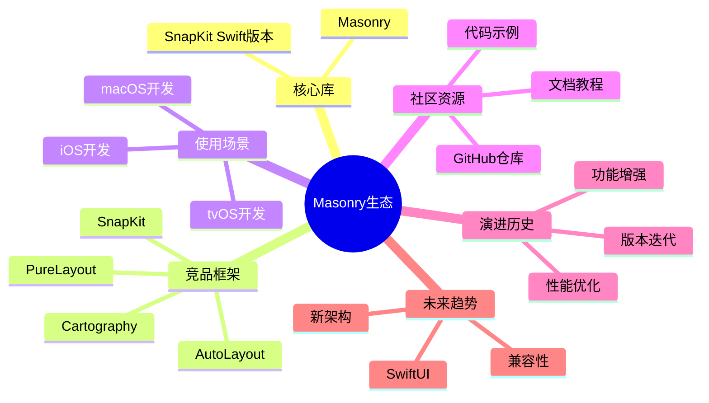

---

## 🏆 竞品对比分析

### 1. Masonry vs PureLayout

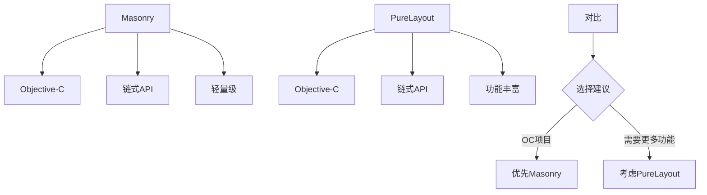

**详细对比表**：
| 特性 | Masonry | PureLayout |
|------|---------|------------|
| **语言** | Objective-C | Objective-C |
| **API风格** | 链式调用 | 链式调用 |
| **代码量** | 极简 | 较多 |
| **功能丰富度** | 核心功能 | 扩展功能多 |
| **学习曲线** | 平缓 | 平缓 |
| **性能** | 优秀 | 优秀 |
| **维护状态** | 稳定 | 活跃 |
| **社区支持** | 广泛 | 良好 |

**代码对比**：
```objective-c
// Masonry
[view mas_makeConstraints:^(MASConstraintMaker *make) {
    make.left.equalTo(superview).offset(10);
    make.top.equalTo(superview).offset(20);
    make.width.mas_equalTo(100);
    make.height.mas_equalTo(50);
}];

// PureLayout
[view autoPinEdgeToSuperviewEdge:ALEdgeLeft withInset:10];
[view autoPinEdgeToSuperviewEdge:ALEdgeTop withInset:20];
[view autoSetDimensionsToSize:CGSizeMake(100, 50)];
```

### 2. Masonry vs SnapKit (Swift)

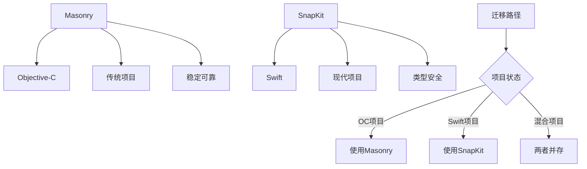

**Swift版本对比**：
```swift
// SnapKit (Swift)
view.snp.makeConstraints { make in
    make.left.equalToSuperview().offset(10)
    make.top.equalToSuperview().offset(20)
    make.width.equalTo(100)
    make.height.equalTo(50)
}

// 与Masonry几乎相同，只是语法差异
```

**选择建议**：
- ✅ **Objective-C项目**：Masonry
- ✅ **Swift项目**：SnapKit
- ✅ **混合项目**：两者都可用

### 3. Masonry vs Cartography

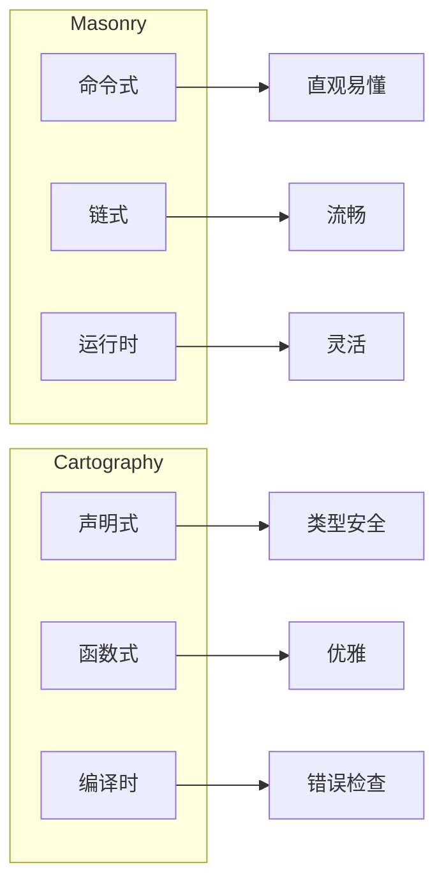

**代码对比**：
```objective-c
// Masonry (命令式)
[view mas_makeConstraints:^(MASConstraintMaker *make) {
    make.left.equalTo(superview).offset(10);
    make.width.mas_equalTo(100);
}];

// Cartography (声明式) - 已停止维护
constrain(view, superview) { view, superview in
    view.left == superview.left + 10
    view.width == 100
}
```

### 4. 与原生 Auto Layout 对比

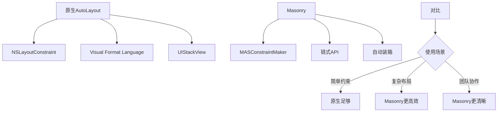

---

## 📈 版本演进历史

### 里程碑版本

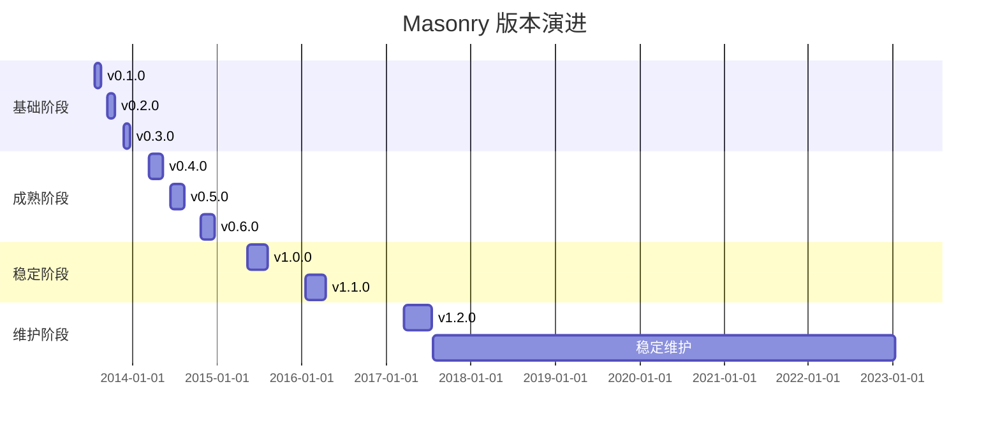

### 关键版本特性

#### v0.1.0 (2013-07-20) - 初始版本
```objective-c
// 基础API
make.left.equalTo(superview);
make.width.mas_equalTo(100);
```
**特性**：
- ✅ 基础链式API
- ✅ 单约束支持
- ✅ iOS/macOS兼容

#### v0.5.0 (2014-06-15) - 复合约束
```objective-c
// 新增复合属性
make.edges.equalTo(superview);
make.size.mas_equalTo(CGSizeMake(100, 100));
make.center.equalTo(superview);
```
**特性**：
- ✅ edges/size/center复合属性
- ✅ 批量操作优化
- ✅ 性能提升

#### v1.0.0 (2015-05-10) - 稳定版
```objective-c
// 完整API
make.left.equalTo(superview).offset(10).priorityHigh();
make.width.equalTo(superview).multipliedBy(0.5);
```
**特性**：
- ✅ 完整的链式配置
- ✅ 优先级支持
- ✅ 乘除法支持
- ✅ 代码稳定

#### v1.1.0 (2016-01-15) - 增强功能
```objective-c
// 新增功能
make.firstBaseline.equalTo(label);
make.safeAreaLayoutGuideTop.equalTo(10);
```
**特性**：
- ✅ 基线对齐
- ✅ 安全区域支持 (iOS 11+)
- ✅ 边距属性

#### v1.2.0 (2017-03-20) - 最终更新
```objective-c
// 调试增强
make.left.offset(10).key(@"leftConstraint");
```
**特性**：
- ✅ 约束标识key
- ✅ 调试支持
- ✅ Bug修复

### 当前状态
- **版本**：v1.2.0 (最新)
- **维护模式**：稳定维护
- **更新频率**：低（仅修复严重Bug）
- **推荐状态**：生产环境可用

---

## 🌍 社区生态

### GitHub 数据

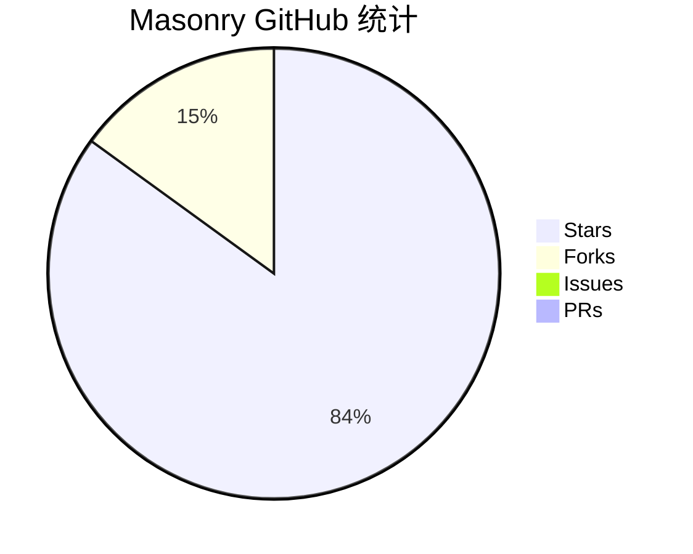

**关键指标**：
- ⭐ **Stars**: 17,000+
- 🍴 **Forks**: 3,000+
- 🐛 **Open Issues**: ~50
- 📝 **Pull Requests**: ~200
- 📊 **使用量**: 数十万应用

### 社区贡献

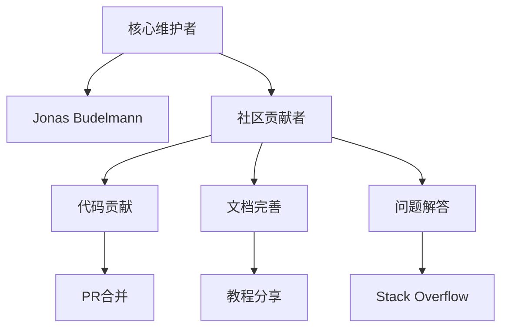

### 学习资源

**官方资源**：
- 📚 GitHub仓库: `https://github.com/SnapKit/Masonry`
- 📖 README文档: 详细使用说明
- 📝 示例代码: Examples目录

**社区资源**：
- 🎓 博客文章: 大量技术博客
- 📹 视频教程: YouTube/B站
- 💬 讨论区: Stack Overflow
- 📱 Demo项目: GitHub示例

---

## 🔄 迁移与兼容性

### 从原生Auto Layout迁移

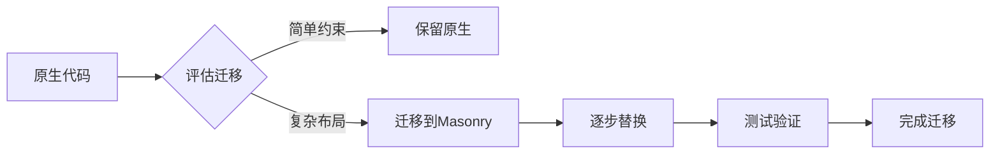

**迁移步骤**：
1. **添加依赖**：Podfile或SPM
2. **导入头文件**：`#import <Masonry/Masonry.h>`
3. **替换代码**：逐个视图迁移
4. **测试验证**：确保布局正确
5. **清理原生**：移除旧代码

**迁移示例**：
```objective-c
// 迁移前 (原生)
view.translatesAutoresizingMaskIntoConstraints = NO;
[NSLayoutConstraint activateConstraints:@[
    [NSLayoutConstraint constraintWithItem:view
                                 attribute:NSLayoutAttributeLeft
                                 relatedBy:NSLayoutRelationEqual
                                    toItem:superview
                                 attribute:NSLayoutAttributeLeft
                                multiplier:1.0
                                  constant:10],
    // ... 更多约束
]];

// 迁移后 (Masonry)
[view mas_makeConstraints:^(MASConstraintMaker *make) {
    make.left.equalTo(superview).offset(10);
    // ... 更多约束
}];
```

### 与其他框架共存

```objective-c
// Masonry + SnapKit (混合项目)
// Objective-C部分
[view mas_makeConstraints:^(MASConstraintMaker *make) {
    make.left.equalTo(superview).offset(10);
}];

// Swift部分
view.snp.makeConstraints { make in
    make.right.equalToSuperview().offset(-10)
}
```

**注意事项**：
- ✅ 两者可以共存，互不干扰
- ⚠️ 避免在同一视图上混用
- ✅ 团队统一使用一种框架

---

## 🚀 未来发展趋势

### 1. SwiftUI 时代的挑战

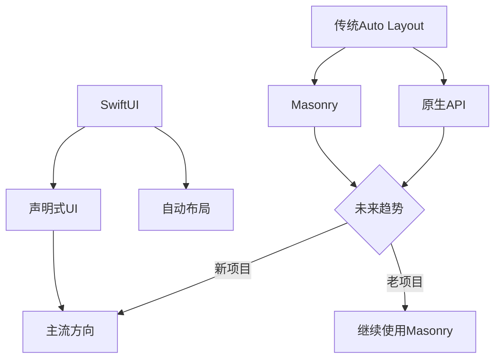

**现状分析**：
- ✅ **SwiftUI**: 未来主流，但目前仅支持iOS 13+
- ✅ **UIKit**: 仍是最广泛使用的框架
- ✅ **Masonry**: 在UIKit生态中仍有重要地位

**使用建议**：
```objective-c
// 新项目 (iOS 13+)
// 推荐：SwiftUI

// 老项目或需要兼容旧系统
// 推荐：Masonry + UIKit

// 混合项目
// 推荐：SwiftUI + Masonry (UIKit部分)
```

### 2. 新架构适配

**MVVM/MVI 架构**：
```objective-c
// ViewModel中定义约束配置
@interface MyViewModel : NSObject
@property (nonatomic, strong) NSArray *constraints;
@end

@implementation MyViewModel

- (NSArray *)makeConstraintsForView:(UIView *)view inSuperview:(UIView *)superview {
    return [view mas_makeConstraints:^(MASConstraintMaker *make) {
        make.edges.equalTo(superview);
    }];
}

@end
```

**组件化架构**：
```objective-c
// 独立组件使用Masonry
@interface CustomButton : UIButton
- (void)setupConstraints;
@end

@implementation CustomButton

- (void)setupConstraints {
    [self mas_makeConstraints:^(MASConstraintMaker *make) {
        make.size.mas_equalTo(CGSizeMake(100, 44));
    }];
}

@end
```

### 3. 性能优化方向

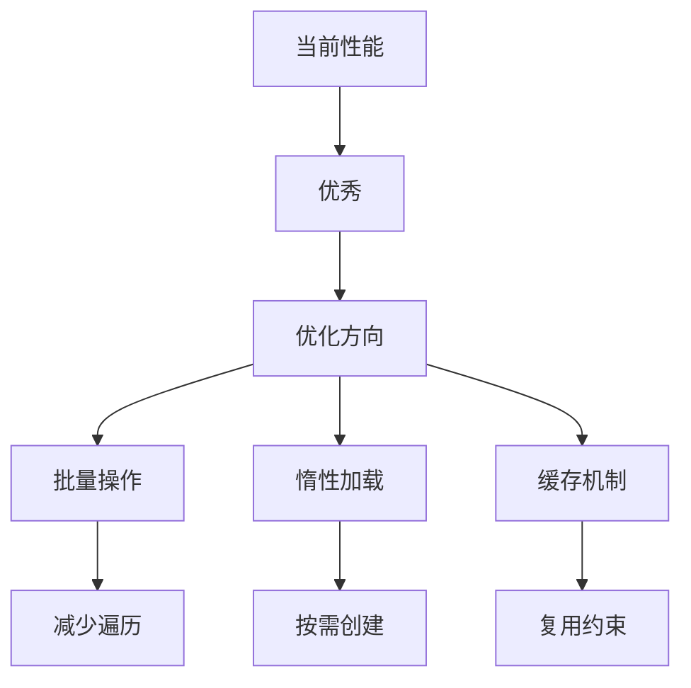

**潜在改进**：
- 🚀 **约束缓存**: 复用已创建的约束对象
- 🚀 **批量更新**: 一次layoutIfNeeded处理多个更新
- 🚀 **异步计算**: 复杂约束计算放到后台线程

### 4. 兼容性演进

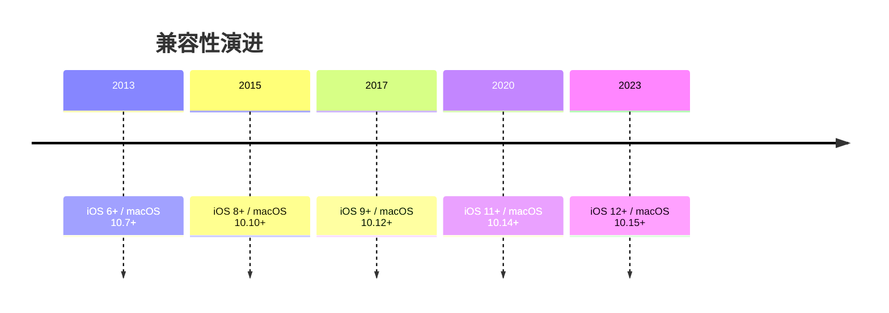

**未来可能**：
- ✅ 支持visionOS
- ✅ 更好的Swift兼容
- ✅ 安全区域增强
- ✅ 动态类型支持

---

## 📊 选择决策树

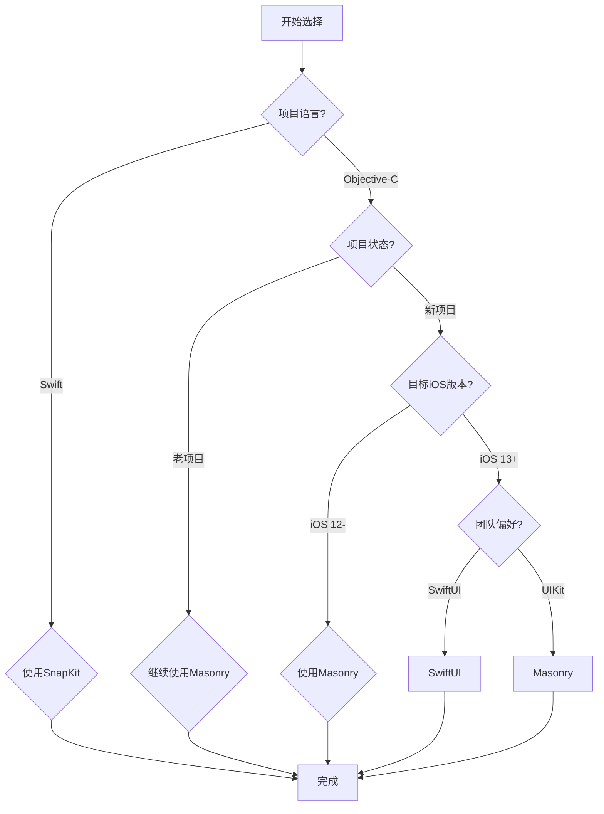

### 决策表

| 场景 | 推荐方案 | 理由 |
|------|---------|------|
| **OC新项目** | Masonry | 成熟稳定，代码简洁 |
| **OC老项目** | Masonry | 无缝集成，零成本迁移 |
| **Swift新项目** | SwiftUI/SnapKit | 现代化，类型安全 |
| **Swift老项目** | SnapKit | 与Masonry语法一致 |
| **混合项目** | 各自最佳 | 互不干扰，灵活选择 |
| **性能敏感** | 原生API | 最小开销 |
| **快速开发** | Masonry | 开发效率最高 |

---

## 🎓 学习路径建议

### 初学者
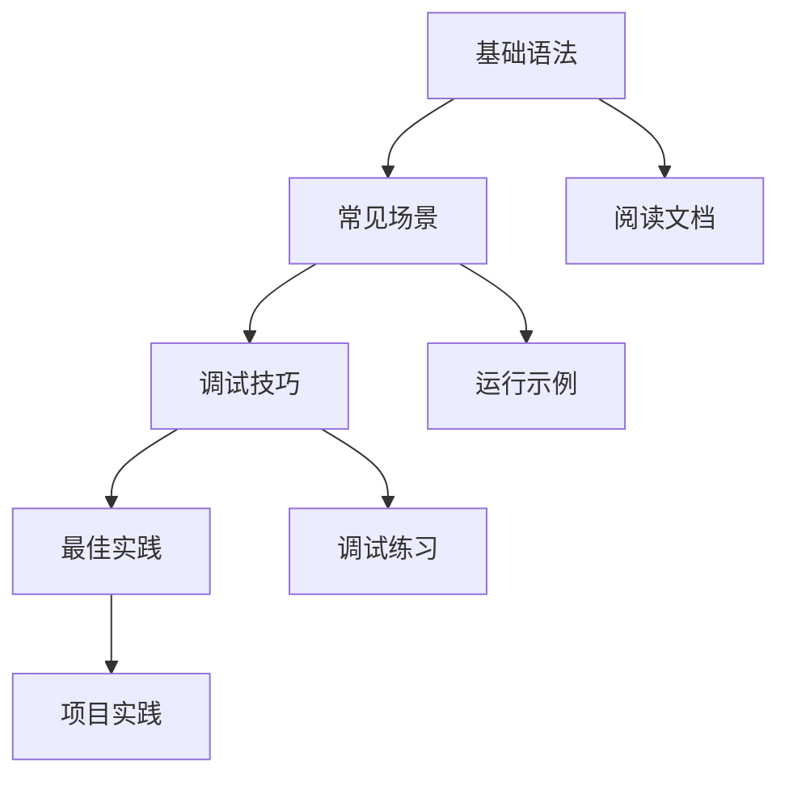

**学习步骤**：
1. **阅读README**：了解基本用法
2. **运行示例**：Examples目录
3. **简单练习**：实现基础布局
4. **复杂场景**：动态布局、动画
5. **源码阅读**：深入理解实现

### 进阶者
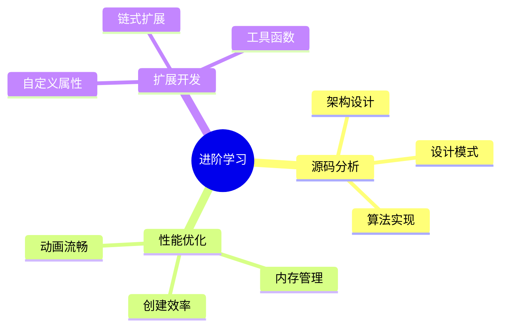

**进阶路径**：
1. **源码阅读**：逐行理解实现
2. **设计模式**：识别并应用
3. **性能调优**：基准测试
4. **扩展开发**：自定义功能
5. **贡献代码**：参与社区

---

## 🔗 相关资源

### 官方资源
- 📦 **GitHub**: https://github.com/SnapKit/Masonry
- 📖 **文档**: README.md
- 📝 **示例**: Examples/Masonry iOS Examples

### 竞品框架
- **PureLayout**: https://github.com/PureLayout/PureLayout
- **SnapKit**: https://github.com/SnapKit/SnapKit
- **Cartography**: https://github.com/robb/Cartography (已停止维护)

### 学习资料
- 🎞️ **教程**: Ray Wenderlich, NSHipster
- 📚 **书籍**: iOS编程相关书籍
- 🎤 **演讲**: WWDC, iOS Conf

---

## 📋 本章要点总结

### 生态现状
- ✅ **成熟稳定**: 经过多年验证
- ✅ **社区活跃**: 广泛使用和贡献
- ✅ **竞品丰富**: 多种选择
- ✅ **文档完善**: 学习资源多

### 选择建议
- **Objective-C**: 首选Masonry
- **Swift**: 首选SnapKit
- **新项目**: 考虑SwiftUI
- **老项目**: 继续使用Masonry

### 未来展望
- **短期**: UIKit生态仍占主导
- **中期**: SwiftUI逐步普及
- **长期**: 可能被SwiftUI取代
- **现在**: Masonry仍是最佳选择之一

### 学习价值
- ✅ 掌握Auto Layout精髓
- ✅ 学习API设计技巧
- ✅ 理解架构设计思想
- ✅ 培养代码质量意识

---

**上一章**：[07_源码深度解析](07_源码深度解析.md)

**返回目录**：[README](../README.md)